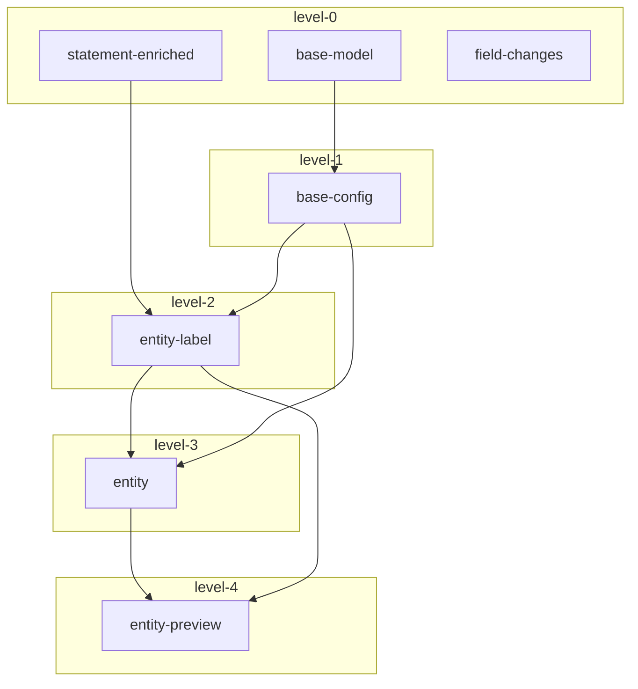

# toolbox-streams
Geovistory toolbox module for aggregating data about entities, implemented with Kafka Streams.

## Layout
```
root
|- app # topologies
|- lib # models and serdes
|- utilities # helpers for developers
```

## Dependencies
The apps depend on each others output topics. 


The arrows point from dependency to dependent app.
The level indicates the level of dependency. For the deployment of new app versions, you can follow the level number.

Example:
If you have a new version of 


## Develop

### Environment
To setup a local dev environment, we recommend https://github.com/lensesio/fast-data-dev.

```bash
docker run --rm -p 2181:2181 -p 3030:3030 -p 8081-8083:8081-8083 -p 9581-9585:9581-9585 -p 9092:9092 -e ADV_HOST=127.0.0.1 lensesio/fast-data-dev:latest
```

For Apple Silicon (M1,M2):

```bash
docker run --rm -p 2181:2181 -p 3030:3030 -p 8081-8083:8081-8083 -p 9581-9585:9581-9585 -p 9092:9092 -e ADV_HOST=127.0.0.1 dougdonohoe/fast-data-dev:latest
```

That's it. Visit http://127.0.0.1:3030 to get into the fast-data-dev environment

### Add source connector


### CLI

For convenience there is a CLI tool to perform cleanup tasks, like:

- batch delete of topics
- batch delete of schemas

In order to connect to the schema registry and to the kafka bootstrap server,
make sure you properly configured .env and have access to the remote servers.

```bash
# run this command for more details
./gradlew utilities:cli --args="--help"
```


## Deploy

### org.geovistory.toolbox.streams.fulltext.App ID


### Base image used by jib

#### build and push base image

Set the correct version number

create multiplatform image:
read here: https://docs.docker.com/build/building/multi-platform/

create and use builder that supports multiplatform builds (if not yet done):
```bash
docker buildx create --name mybuilder --driver docker-container --bootstrap --use
```

login to github container registry with docker cli (see (official docs)[https://docs.github.com/en/packages/working-with-a-github-packages-registry/working-with-the-container-registry#authenticating-to-the-container-registry])

1. Create a new GitHub personal access token (classic) with write access to packages
2. Save your personal access token.
```bash
export CR_PAT=YOUR_TOKEN
```
3. Using the CLI for your container type, sign in to the Container registry service at ghcr.io.
```bash
echo $CR_PAT | docker login ghcr.io -u USERNAME --password-stdin
> Login Succeeded
```

build the images for amd64 and arm64 and load it to docker

Update the version tag manually (e.g. increase version number after point)
```bash
docker buildx build --platform linux/amd64,linux/arm64 -t ghcr.io/geovistory/kafka-streams-base:0.2 . --load
```

#### use base image

In `./app/build.gradle` update `jib.from.image` to the new tag.


