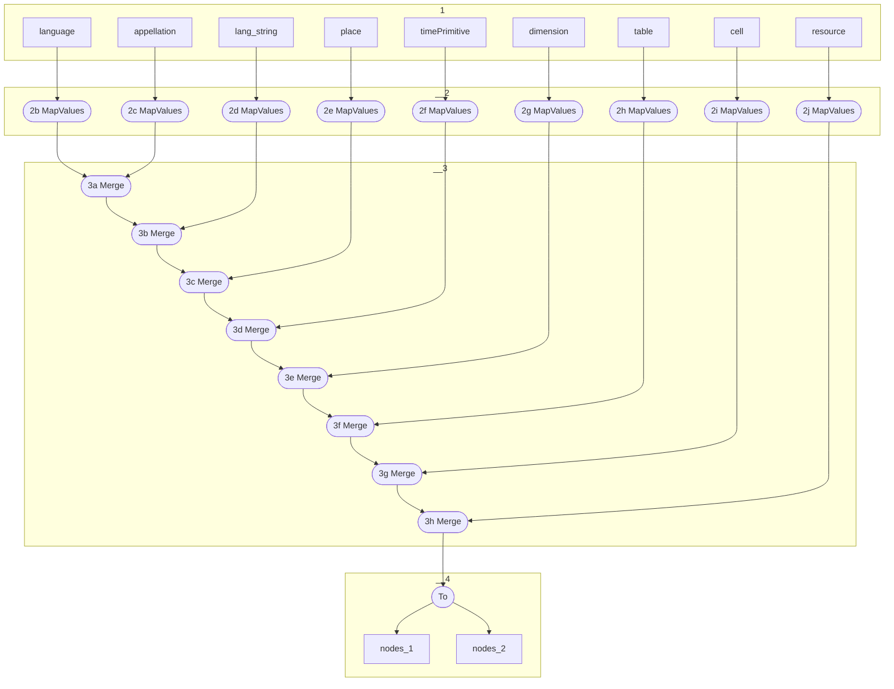

# Topology: Statement Enriched

This topology enriches statements with their objects.

| Step |                              |
|------|------------------------------|
| 1    | input topics                 |
| 2    | MapValues to Node            |
| 3    | merge streams enriching Node |
| 4    | sink to two topics           |

## Input Topics

_{prefix_in} = TS_INPUT_TOPIC_NAME_PREFIX_

_{prefix_out} = TS_OUTPUT_TOPIC_NAME_PREFIX_

| name                                      | label in diagram | Type    |
|-------------------------------------------|------------------|---------|
| {input_prefix}_information_resource       | resource         | KStream |
| {input_prefix}_information_language       | language         | KStream |
| {input_prefix}_information_appellation    | appellation      | KStream |
| {input_prefix}_information_lang_string    | lang_string      | KStream |
| {input_prefix}_information_place          | place            | KStream |
| {input_prefix}_information_time_primitive | time_primitive   | KStream |
| {input_prefix}_information_dimension      | dimension        | KStream |
| {input_prefix}_information_table          | table            | KStream |
| {input_prefix}_information_cell           | cell             | KStream |

## Output topics

| name                  | label in diagram |
|-----------------------|----------------|
| {output_prefix}_nodes | nodes          |

## Output model

### Key

NodeKey

### Value

NodeValue