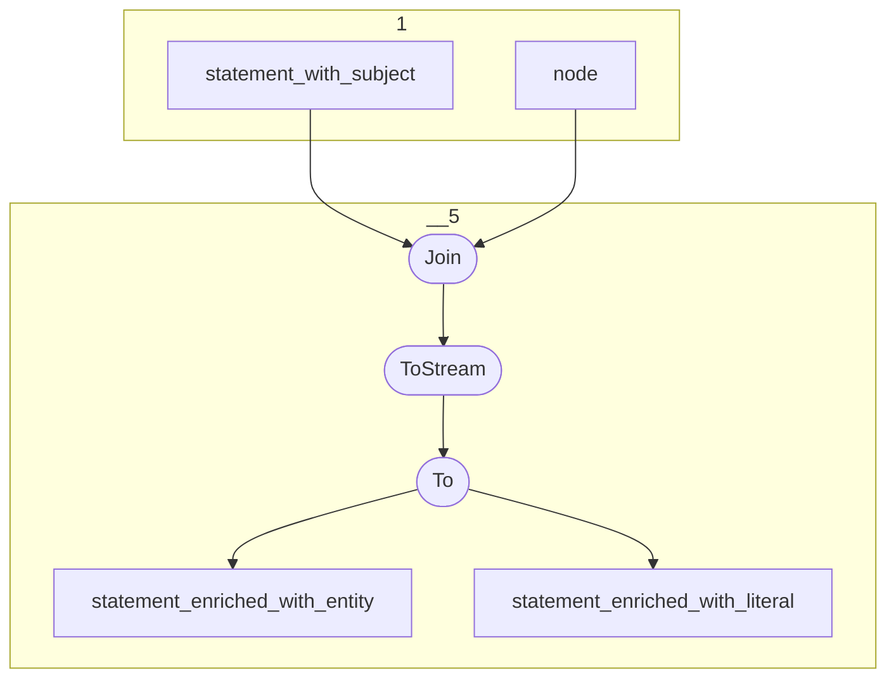

# Topology: Statement Enriched

This topology enriches statements with their objects.

| Step |                                                                                   |
|------|-----------------------------------------------------------------------------------|
| 1    | input topics                                                                      |
| 5    | Join statement with Nodes on object id                                            |
|      | Split stream in branches of statements with literals and statements with entities |

## Input Topics

_{prefix_out} = TS_OUTPUT_TOPIC_NAME_PREFIX_

| name                                | label in diagram       | Type   |
|-------------------------------------|------------------------|--------|
| {prefix_out}_statement_with_subject | statement_with_subject | KTable |
| {prefix_out}_node                   | node                   | KTable |

## Output topics

| name                                            | label in diagram                |
|-------------------------------------------------|---------------------------------|
| {output_prefix}_statement_enriched_with_entity  | statement_enriched_with_entity  |
| {output_prefix}_statement_enriched_with_literal | statement_enriched_with_literal |

## Output model

### Key

InfStatementKey

### Value

StatementEnrichedValue