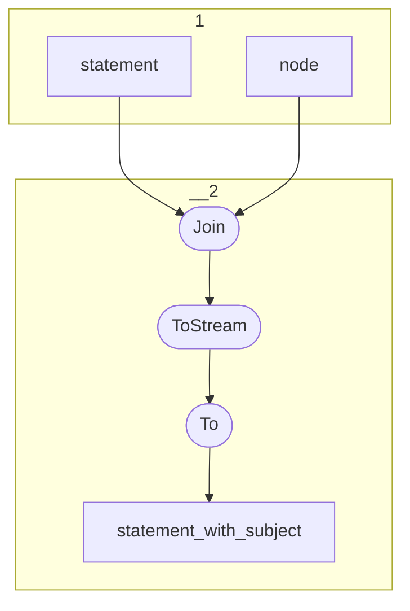

# Topology: Statement Enriched

This topology enriches statements with their objects.

| Step |                                                                                   |
|------|-----------------------------------------------------------------------------------|
| 1    | input topics                                                                      |
| 2    | Join statement with Nodes on subject id                                           |

## Input Topics

_{prefix_in} = TS_INPUT_TOPIC_NAME_PREFIX_

_{prefix_out} = TS_OUTPUT_TOPIC_NAME_PREFIX_

| name                                  | label in diagram | Type   |
|---------------------------------------|------------------|--------|
| {input_prefix}_projects_info_proj_rel | info_proj_rel    | KTable |
| {input_prefix}_information_resource   | resource         | KTable |

## Output topics

| name                                   | label in diagram       |
|----------------------------------------|------------------------|
| {output_prefix}_statement_with_subject | statement_with_subject |

## Output model

### Key

InfStatementKey

### Value

NodeValue