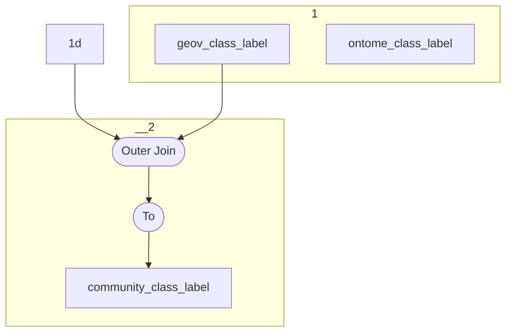

# Topology: CommunityClassLabel

This topology generates community labels of classes.

| Step |                                                                             |
|------|-----------------------------------------------------------------------------|
| 1    | input topics                                                                |
| 2    | Join on OntomeClassLabelKey taking geov label if present, else ontome label |
| 3    | To topic `community_class_label`                                            |

## Input Topics

_{prefix_out} = TS_OUTPUT_TOPIC_NAME_PREFIX_

| name                               | label in diagram   | Type   |
|------------------------------------|--------------------|--------|
| {output_prefix}_ontome_class_label | ontome_class_label | KTable |
| {output_prefix}_geov_class_label   | geov_class_label   | KTable |

## Output topic

| name                                  | label in diagram      |
|---------------------------------------|-----------------------|
| {output_prefix}_community_class_label | community_class_label |

## Output model

### key OntomeClassLabelKey

| field       | type |
|-------------|------|
| class_id    | int  |
| language_id | int  |

### value CommunityClassLabelValue

| field     | type          |
|-----------|---------------|
| label     | string        |
| __deleted | boolean, null |