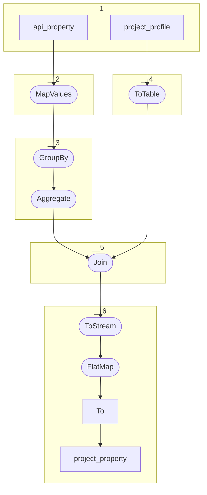

# Topology: ProjectProperty

| Step |                                                                                                                                                                                                             |
|------|-------------------------------------------------------------------------------------------------------------------------------------------------------------------------------------------------------------|
| 1    | input topics                                                                                                                                                                                                |
| 2    | MapValues: project the stream to ProfilePropertyValue: profileId, domainId, propertyId, rangeId, deleted                                                                                                    |
| 3    | GroupBy profileId and Aggregate to a PropertyProfileMap, concatenating profileId, domainId, propertyId and rangeId to a key and using ProfilePropertyValue as value. This removes duplicates of properties. |
| 4    | ToTable                                                                                                                                                                                                     |
| 5    | Join: KTable-KTable-Foreign-key-Join on profileId                                                                                                                                                           |
| 6    | ToStream: convert table to a stream; FlatMap: Flatten aggregated properties to project-property messages; To: Write to topic project_property                                                               |

## Input Topics

_{prefix_in} = TS_INPUT_TOPIC_NAME_PREFIX_
 
_{prefix_out} = TS_OUTPUT_TOPIC_NAME_PREFIX_

| name                                      | label in diagram | Type    |
|-------------------------------------------|------------------|---------|
| {prefix_in}.data_for_history.api_property | api_property     | KTable  |
| {prefix_out}.project_profile              | project_profile  | KStream |

## Output topic

| name                      | label in diagram |
|---------------------------|------------------|
| {prefix}.project_property | project_property |

## Output model

| name  | description                                         |
|-------|-----------------------------------------------------|
| Key   | projectId, domainId, propertyId, rangeId            |
| Value | projectId, domainId, propertyId, rangeId, __deleted |
