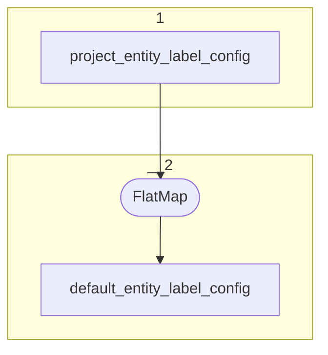

# Topology: CommunityEntityLabelConfig

This topology generates project entities by projectId and entityId.

| Step |                                                                     |
|------|---------------------------------------------------------------------|
| 1    | input topics                                                        |
| 2    | Flat Map: keep only records with `fk_project=375669`, Key: class_id |
| 3    | join on fk_class, if project                                        |

## Input Topics

_{prefix_in} = TS_INPUT_TOPIC_NAME_PREFIX_

_{prefix_out} = TS_OUTPUT_TOPIC_NAME_PREFIX_

| name                                       | label in diagram            | Type   |
|--------------------------------------------|-----------------------------|--------|
| {input_prefix}_project_entity_label_config | project_entity_label_config | KTable |

## Output topics

| name                                                 | label in diagram                     |
|------------------------------------------------------|--------------------------------------|
| {output_prefix}_project_entity_label_config_enriched | project_entity_label_config_enriched |
| {output_prefix}_default_entity_label_config          | default_entity_label_config          |

## Output model default_entity_label_config

### key

| field    | type |
|----------|------|
| class_id | int  |

### value

| field     | type                   |
|-----------|------------------------|
| class_id  | int                    |
| config    | EntityLabelConfigValue |
| __deleted | boolean, null          |

## Output model project_entity_label_config_enriched

### key

| field      | type |
|------------|------|
| project_id | int  |
| class_id   | int  |

### value

| field     | type                   |
|-----------|------------------------|
| class_id  | int                    |
| config    | EntityLabelConfigValue |
| __deleted | boolean, null          |
