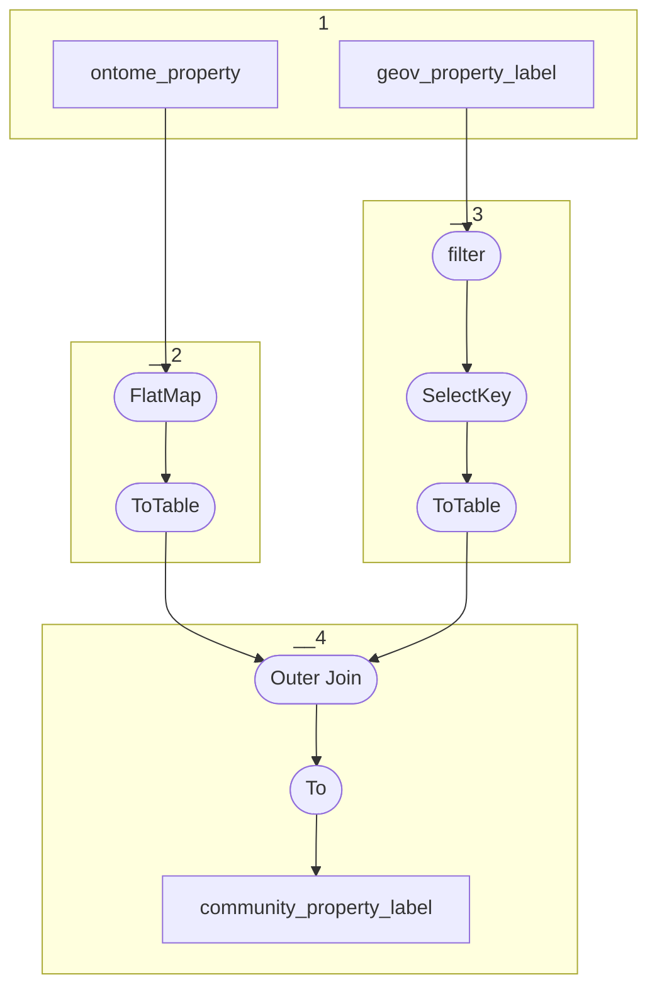

# Topology: CommunityClassLabel

This topology generates community labels of properties.

| Step |                                                                                                    |
|------|----------------------------------------------------------------------------------------------------|
| 1    | input topics                                                                                       |
| 2    | FlatMap: per input create two outputs of CommunityPropertyLabelKey and CommunityPropertyLabelValue |
| 3    | Filter default project and Co-partition by CommunityPropertyLabelKey                               |
| 4    | Join on OntomePropertyLabelKey taking geov label if present, else ontome label                     |
| 3    | To topic `community_property_label`                                                                |

## Input Topics

_{prefix_out} = TS_OUTPUT_TOPIC_NAME_PREFIX_

| name                                  | label in diagram      | Type   |
|---------------------------------------|-----------------------|--------|
| {output_prefix}_ontome_property_label | ontome_property_label | KTable |
| {output_prefix}_geov_property_label   | geov_property_label   | KTable |

## Output topic

| name                                     | label in diagram         |
|------------------------------------------|--------------------------|
| {output_prefix}_community_property_label | community_property_label |

## Output model

### key CommunityPropertyLabelKey

| field       | type    |
|-------------|---------|
| class_id    | int     |
| property_id | int     |
| is_outgoing | boolean |
| language_id | int     |

### value CommunityPropertyLabelValue

| field     | type          |
|-----------|---------------|
| label     | string        |
| __deleted | boolean, null |