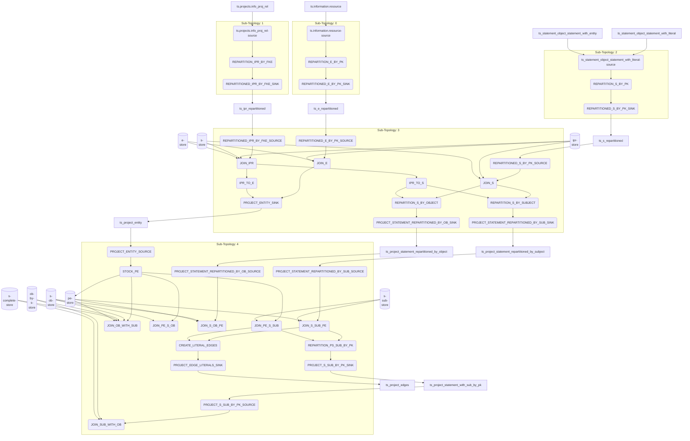

```mermaid
graph TD
ts.information.resource[ts.information.resource] --> ts.information.resource-source(ts.information.resource-<br>source)
REPARTITIONED_E_BY_PK_SINK(REPARTITIONED_E_BY_PK_SINK) --> ts_e_repartitioned[ts_e_repartitioned]
ts.projects.info_proj_rel[ts.projects.info_proj_rel] --> ts.projects.info_proj_rel-source(ts.projects.info_proj_rel-<br>source)
REPARTITIONED_IPR_BY_FKE_SINK(REPARTITIONED_IPR_BY_FKE_SINK) --> ts_ipr_repartitioned[ts_ipr_repartitioned]
ts_statement_object_statement_with_entity[ts_statement_object_statement_with_entity] --> ts_statement_object_statement_with_literal-source(ts_statement_object_statement_with_literal-<br>source)
ts_statement_object_statement_with_literal[ts_statement_object_statement_with_literal] --> ts_statement_object_statement_with_literal-source(ts_statement_object_statement_with_literal-<br>source)
REPARTITIONED_S_BY_PK_SINK(REPARTITIONED_S_BY_PK_SINK) --> ts_s_repartitioned[ts_s_repartitioned]
ts_ipr_repartitioned[ts_ipr_repartitioned] --> REPARTITIONED_IPR_BY_FKE_SOURCE(REPARTITIONED_IPR_BY_FKE_SOURCE)
e-store[(e-<br>store)] --> JOIN_IPR(JOIN_IPR)
s-store[(s-<br>store)] --> JOIN_IPR(JOIN_IPR)
ipr-store[(ipr-<br>store)] --> JOIN_IPR(JOIN_IPR)
ts_s_repartitioned[ts_s_repartitioned] --> REPARTITIONED_S_BY_PK_SOURCE(REPARTITIONED_S_BY_PK_SOURCE)
s-store[(s-<br>store)] --> JOIN_S(JOIN_S)
ipr-store[(ipr-<br>store)] --> JOIN_S(JOIN_S)
ts_e_repartitioned[ts_e_repartitioned] --> REPARTITIONED_E_BY_PK_SOURCE(REPARTITIONED_E_BY_PK_SOURCE)
e-store[(e-<br>store)] --> JOIN_E(JOIN_E)
ipr-store[(ipr-<br>store)] --> JOIN_E(JOIN_E)
PROJECT_ENTITY_SINK(PROJECT_ENTITY_SINK) --> ts_project_entity[ts_project_entity]
PROJECT_STATEMENT_REPARTITIONED_BY_OB_SINK(PROJECT_STATEMENT_REPARTITIONED_BY_OB_SINK) --> ts_project_statement_repartitioned_by_object[ts_project_statement_repartitioned_by_object]
PROJECT_STATEMENT_REPARTITIONED_BY_SUB_SINK(PROJECT_STATEMENT_REPARTITIONED_BY_SUB_SINK) --> ts_project_statement_repartitioned_by_subject[ts_project_statement_repartitioned_by_subject]
ts_project_entity[ts_project_entity] --> PROJECT_ENTITY_SOURCE(PROJECT_ENTITY_SOURCE)
STOCK_PE(STOCK_PE) --> pe-store[(pe-<br>store)]
ts_project_statement_repartitioned_by_subject[ts_project_statement_repartitioned_by_subject] --> PROJECT_STATEMENT_REPARTITIONED_BY_SUB_SOURCE(PROJECT_STATEMENT_REPARTITIONED_BY_SUB_SOURCE)
s-sub-store[(s-<br>sub-<br>store)] --> JOIN_PE_S_SUB(JOIN_PE_S_SUB)
pe-store[(pe-<br>store)] --> JOIN_S_SUB_PE(JOIN_S_SUB_PE)
s-sub-store[(s-<br>sub-<br>store)] --> JOIN_S_SUB_PE(JOIN_S_SUB_PE)
ts_project_statement_repartitioned_by_object[ts_project_statement_repartitioned_by_object] --> PROJECT_STATEMENT_REPARTITIONED_BY_OB_SOURCE(PROJECT_STATEMENT_REPARTITIONED_BY_OB_SOURCE)
ts_project_statement_with_sub_by_pk[ts_project_statement_with_sub_by_pk] --> PROJECT_S_SUB_BY_PK_SOURCE(PROJECT_S_SUB_BY_PK_SOURCE)
pe-store[(pe-<br>store)] --> JOIN_OB_WITH_SUB(JOIN_OB_WITH_SUB)
s-complete-store[(s-<br>complete-<br>store)] --> JOIN_OB_WITH_SUB(JOIN_OB_WITH_SUB)
ob-by-s-store[(ob-<br>by-<br>s-<br>store)] --> JOIN_OB_WITH_SUB(JOIN_OB_WITH_SUB)
s-ob-store[(s-<br>ob-<br>store)] --> JOIN_OB_WITH_SUB(JOIN_OB_WITH_SUB)
s-ob-store[(s-<br>ob-<br>store)] --> JOIN_PE_S_OB(JOIN_PE_S_OB)
s-complete-store[(s-<br>complete-<br>store)] --> JOIN_SUB_WITH_OB(JOIN_SUB_WITH_OB)
ob-by-s-store[(ob-<br>by-<br>s-<br>store)] --> JOIN_SUB_WITH_OB(JOIN_SUB_WITH_OB)
pe-store[(pe-<br>store)] --> JOIN_S_OB_PE(JOIN_S_OB_PE)
s-ob-store[(s-<br>ob-<br>store)] --> JOIN_S_OB_PE(JOIN_S_OB_PE)
PROJECT_EDGE_LITERALS_SINK(PROJECT_EDGE_LITERALS_SINK) --> ts_project_edges[ts_project_edges]
PROJECT_S_SUB_BY_PK_SINK(PROJECT_S_SUB_BY_PK_SINK) --> ts_project_statement_with_sub_by_pk[ts_project_statement_with_sub_by_pk]
subgraph Sub-Topology: 0
ts.information.resource-source(ts.information.resource-<br>source) --> REPARTITION_E_BY_PK(REPARTITION_E_BY_PK)
REPARTITION_E_BY_PK(REPARTITION_E_BY_PK) --> REPARTITIONED_E_BY_PK_SINK(REPARTITIONED_E_BY_PK_SINK)
end
subgraph Sub-Topology: 1
ts.projects.info_proj_rel-source(ts.projects.info_proj_rel-<br>source) --> REPARTITION_IPR_BY_FKE(REPARTITION_IPR_BY_FKE)
REPARTITION_IPR_BY_FKE(REPARTITION_IPR_BY_FKE) --> REPARTITIONED_IPR_BY_FKE_SINK(REPARTITIONED_IPR_BY_FKE_SINK)
end
subgraph Sub-Topology: 2
ts_statement_object_statement_with_literal-source(ts_statement_object_statement_with_literal-<br>source) --> REPARTITION_S_BY_PK(REPARTITION_S_BY_PK)
REPARTITION_S_BY_PK(REPARTITION_S_BY_PK) --> REPARTITIONED_S_BY_PK_SINK(REPARTITIONED_S_BY_PK_SINK)
end
subgraph Sub-Topology: 3
REPARTITIONED_IPR_BY_FKE_SOURCE(REPARTITIONED_IPR_BY_FKE_SOURCE) --> JOIN_IPR(JOIN_IPR)
JOIN_IPR(JOIN_IPR) --> IPR_TO_S(IPR_TO_S)
JOIN_IPR(JOIN_IPR) --> IPR_TO_E(IPR_TO_E)
REPARTITIONED_S_BY_PK_SOURCE(REPARTITIONED_S_BY_PK_SOURCE) --> JOIN_S(JOIN_S)
IPR_TO_S(IPR_TO_S) --> REPARTITION_S_BY_SUBJECT(REPARTITION_S_BY_SUBJECT)
IPR_TO_S(IPR_TO_S) --> REPARTITION_S_BY_OBJECT(REPARTITION_S_BY_OBJECT)
JOIN_S(JOIN_S) --> REPARTITION_S_BY_SUBJECT(REPARTITION_S_BY_SUBJECT)
JOIN_S(JOIN_S) --> REPARTITION_S_BY_OBJECT(REPARTITION_S_BY_OBJECT)
REPARTITIONED_E_BY_PK_SOURCE(REPARTITIONED_E_BY_PK_SOURCE) --> JOIN_E(JOIN_E)
IPR_TO_E(IPR_TO_E) --> PROJECT_ENTITY_SINK(PROJECT_ENTITY_SINK)
JOIN_E(JOIN_E) --> PROJECT_ENTITY_SINK(PROJECT_ENTITY_SINK)
REPARTITION_S_BY_OBJECT(REPARTITION_S_BY_OBJECT) --> PROJECT_STATEMENT_REPARTITIONED_BY_OB_SINK(PROJECT_STATEMENT_REPARTITIONED_BY_OB_SINK)
REPARTITION_S_BY_SUBJECT(REPARTITION_S_BY_SUBJECT) --> PROJECT_STATEMENT_REPARTITIONED_BY_SUB_SINK(PROJECT_STATEMENT_REPARTITIONED_BY_SUB_SINK)
end
subgraph Sub-Topology: 4
PROJECT_ENTITY_SOURCE(PROJECT_ENTITY_SOURCE) --> STOCK_PE(STOCK_PE)
STOCK_PE(STOCK_PE) --> JOIN_PE_S_SUB(JOIN_PE_S_SUB)
STOCK_PE(STOCK_PE) --> JOIN_OB_WITH_SUB(JOIN_OB_WITH_SUB)
STOCK_PE(STOCK_PE) --> JOIN_PE_S_OB(JOIN_PE_S_OB)
PROJECT_STATEMENT_REPARTITIONED_BY_SUB_SOURCE(PROJECT_STATEMENT_REPARTITIONED_BY_SUB_SOURCE) --> JOIN_S_SUB_PE(JOIN_S_SUB_PE)
JOIN_PE_S_SUB(JOIN_PE_S_SUB) --> CREATE_LITERAL_EDGES(CREATE_LITERAL_EDGES)
JOIN_PE_S_SUB(JOIN_PE_S_SUB) --> REPARTITION_PS_SUB_BY_PK(REPARTITION_PS_SUB_BY_PK)
JOIN_S_SUB_PE(JOIN_S_SUB_PE) --> CREATE_LITERAL_EDGES(CREATE_LITERAL_EDGES)
JOIN_S_SUB_PE(JOIN_S_SUB_PE) --> REPARTITION_PS_SUB_BY_PK(REPARTITION_PS_SUB_BY_PK)
CREATE_LITERAL_EDGES(CREATE_LITERAL_EDGES) --> PROJECT_EDGE_LITERALS_SINK(PROJECT_EDGE_LITERALS_SINK)
PROJECT_STATEMENT_REPARTITIONED_BY_OB_SOURCE(PROJECT_STATEMENT_REPARTITIONED_BY_OB_SOURCE) --> JOIN_S_OB_PE(JOIN_S_OB_PE)
PROJECT_S_SUB_BY_PK_SOURCE(PROJECT_S_SUB_BY_PK_SOURCE) --> JOIN_SUB_WITH_OB(JOIN_SUB_WITH_OB)
REPARTITION_PS_SUB_BY_PK(REPARTITION_PS_SUB_BY_PK) --> PROJECT_S_SUB_BY_PK_SINK(PROJECT_S_SUB_BY_PK_SINK)
end
ts.information.resource
ts.projects.info_proj_rel
ts_statement_object_statement_with_entity
ts_statement_object_statement_with_literal
ts_ipr_repartitioned
ts_s_repartitioned
ts_e_repartitioned
ts_project_entity
ts_project_statement_repartitioned_by_subject
ts_project_statement_repartitioned_by_object
ts_project_statement_with_sub_by_pk
ts_e_repartitioned
ts_ipr_repartitioned
ts_s_repartitioned
ts_project_entity
ts_project_statement_repartitioned_by_object
ts_project_statement_repartitioned_by_subject
ts_project_edges
ts_project_statement_with_sub_by_pk
e-store
s-store
ipr-store
s-store
ipr-store
e-store
ipr-store
pe-store
s-sub-store
pe-store
s-sub-store
pe-store
s-complete-store
ob-by-s-store
s-ob-store
s-ob-store
s-complete-store
ob-by-s-store
pe-store
s-ob-store
```