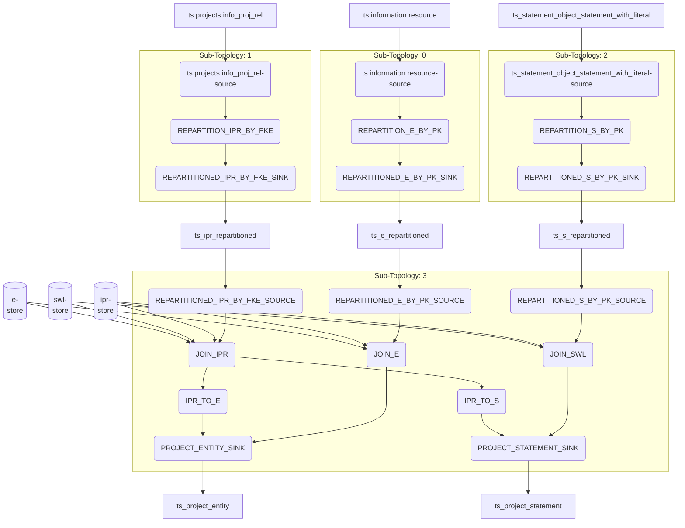

```mermaid
graph TD
ts.information.resource[ts.information.resource] --> ts.information.resource-source(ts.information.resource-<br>source)
REPARTITIONED_E_BY_PK_SINK(REPARTITIONED_E_BY_PK_SINK) --> ts_e_repartitioned[ts_e_repartitioned]
ts.projects.info_proj_rel[ts.projects.info_proj_rel] --> ts.projects.info_proj_rel-source(ts.projects.info_proj_rel-<br>source)
REPARTITIONED_IPR_BY_FKE_SINK(REPARTITIONED_IPR_BY_FKE_SINK) --> ts_ipr_repartitioned[ts_ipr_repartitioned]
ts_statement_object_statement_with_literal[ts_statement_object_statement_with_literal] --> ts_statement_object_statement_with_literal-source(ts_statement_object_statement_with_literal-<br>source)
REPARTITIONED_S_BY_PK_SINK(REPARTITIONED_S_BY_PK_SINK) --> ts_s_repartitioned[ts_s_repartitioned]
ts_ipr_repartitioned[ts_ipr_repartitioned] --> REPARTITIONED_IPR_BY_FKE_SOURCE(REPARTITIONED_IPR_BY_FKE_SOURCE)
e-store[(e-<br>store)] --> JOIN_IPR(JOIN_IPR)
swl-store[(swl-<br>store)] --> JOIN_IPR(JOIN_IPR)
ipr-store[(ipr-<br>store)] --> JOIN_IPR(JOIN_IPR)
ts_e_repartitioned[ts_e_repartitioned] --> REPARTITIONED_E_BY_PK_SOURCE(REPARTITIONED_E_BY_PK_SOURCE)
ts_s_repartitioned[ts_s_repartitioned] --> REPARTITIONED_S_BY_PK_SOURCE(REPARTITIONED_S_BY_PK_SOURCE)
e-store[(e-<br>store)] --> JOIN_E(JOIN_E)
ipr-store[(ipr-<br>store)] --> JOIN_E(JOIN_E)
swl-store[(swl-<br>store)] --> JOIN_SWL(JOIN_SWL)
ipr-store[(ipr-<br>store)] --> JOIN_SWL(JOIN_SWL)
PROJECT_ENTITY_SINK(PROJECT_ENTITY_SINK) --> ts_project_entity[ts_project_entity]
PROJECT_STATEMENT_SINK(PROJECT_STATEMENT_SINK) --> ts_project_statement[ts_project_statement]
subgraph Sub-Topology: 0
ts.information.resource-source(ts.information.resource-<br>source) --> REPARTITION_E_BY_PK(REPARTITION_E_BY_PK)
REPARTITION_E_BY_PK(REPARTITION_E_BY_PK) --> REPARTITIONED_E_BY_PK_SINK(REPARTITIONED_E_BY_PK_SINK)
end
subgraph Sub-Topology: 1
ts.projects.info_proj_rel-source(ts.projects.info_proj_rel-<br>source) --> REPARTITION_IPR_BY_FKE(REPARTITION_IPR_BY_FKE)
REPARTITION_IPR_BY_FKE(REPARTITION_IPR_BY_FKE) --> REPARTITIONED_IPR_BY_FKE_SINK(REPARTITIONED_IPR_BY_FKE_SINK)
end
subgraph Sub-Topology: 2
ts_statement_object_statement_with_literal-source(ts_statement_object_statement_with_literal-<br>source) --> REPARTITION_S_BY_PK(REPARTITION_S_BY_PK)
REPARTITION_S_BY_PK(REPARTITION_S_BY_PK) --> REPARTITIONED_S_BY_PK_SINK(REPARTITIONED_S_BY_PK_SINK)
end
subgraph Sub-Topology: 3
REPARTITIONED_IPR_BY_FKE_SOURCE(REPARTITIONED_IPR_BY_FKE_SOURCE) --> JOIN_IPR(JOIN_IPR)
JOIN_IPR(JOIN_IPR) --> IPR_TO_E(IPR_TO_E)
JOIN_IPR(JOIN_IPR) --> IPR_TO_S(IPR_TO_S)
REPARTITIONED_E_BY_PK_SOURCE(REPARTITIONED_E_BY_PK_SOURCE) --> JOIN_E(JOIN_E)
REPARTITIONED_S_BY_PK_SOURCE(REPARTITIONED_S_BY_PK_SOURCE) --> JOIN_SWL(JOIN_SWL)
IPR_TO_E(IPR_TO_E) --> PROJECT_ENTITY_SINK(PROJECT_ENTITY_SINK)
IPR_TO_S(IPR_TO_S) --> PROJECT_STATEMENT_SINK(PROJECT_STATEMENT_SINK)
JOIN_E(JOIN_E) --> PROJECT_ENTITY_SINK(PROJECT_ENTITY_SINK)
JOIN_SWL(JOIN_SWL) --> PROJECT_STATEMENT_SINK(PROJECT_STATEMENT_SINK)
end
ts.information.resource
ts.projects.info_proj_rel
ts_statement_object_statement_with_literal
ts_ipr_repartitioned
ts_e_repartitioned
ts_s_repartitioned
ts_e_repartitioned
ts_ipr_repartitioned
ts_s_repartitioned
ts_project_entity
ts_project_statement
e-store
swl-store
ipr-store
e-store
ipr-store
swl-store
ipr-store
```