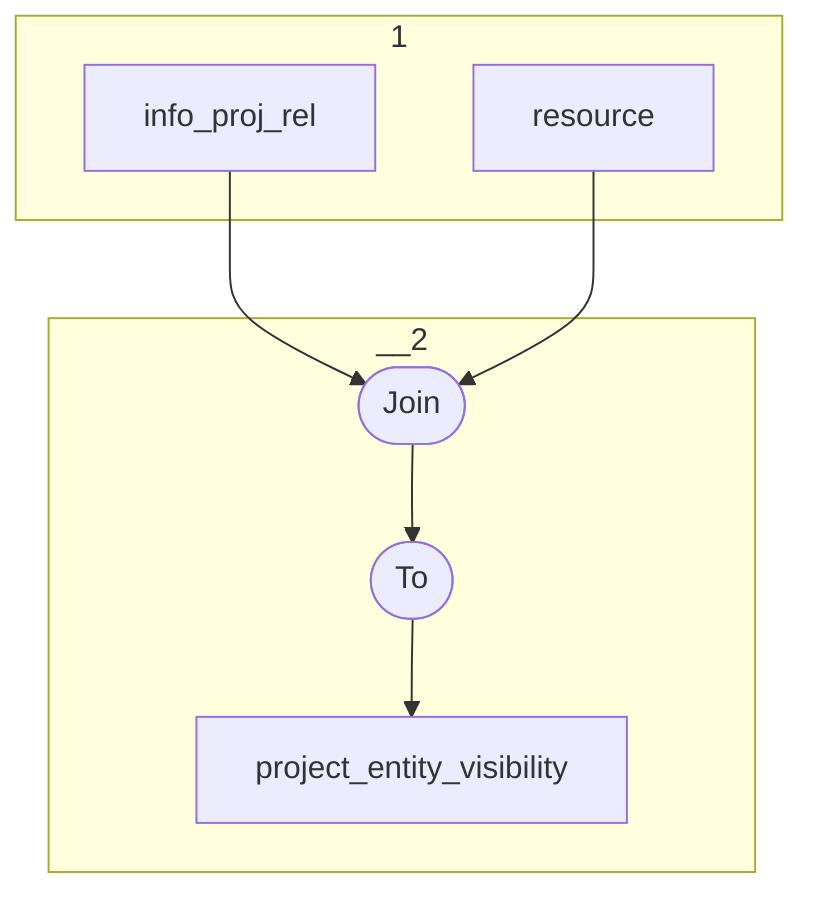

# Topology: ProjectEntityVisibility

This topology generates project entities by projectId and entityId, including visibility.

| Step |                                      |
|------|--------------------------------------|
| 1    | input topics                         |
| 2    | Join                                 |
|      | To topic `project_entity_visibility` |

## Input Topics

_{prefix_in} = TS_INPUT_TOPIC_NAME_PREFIX_

_{prefix_out} = TS_OUTPUT_TOPIC_NAME_PREFIX_

| name                                  | label in diagram | Type   |
|---------------------------------------|------------------|--------|
| {input_prefix}_projects_info_proj_rel | info_proj_rel    | KTable |
| {input_prefix}_information_resource   | resource         | KTable |

## Output topic

| name                                      | label in diagram          |
|-------------------------------------------|---------------------------|
| {output_prefix}_project_entity_visibility | project_entity_visibility |

## Output model

### Key ProjectEntityKey

| field      | type   |
|------------|--------|
| entity_id  | string |
| project_id | int    |

### Value ProjectEntityVisibilityValue

| field                         | type          |
|-------------------------------|---------------|
| entity_id                     | string        |
| project_id                    | int           |
| class_id                      | int           |
| community_visibility_toolbox  | boolean       |
| community_visibility_data_api | boolean       |
| community_visibility_website  | boolean       |
| __deleted                     | boolean, null |

