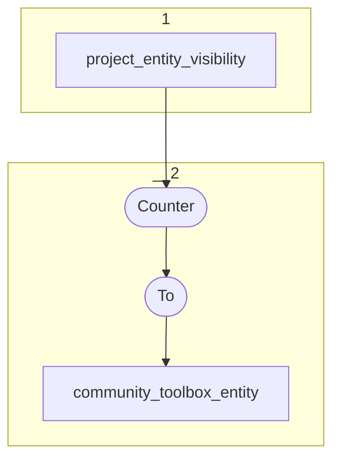

# Topology: CommunityToolboxEntity

This topology generates entities visible for the toolbox community.

| Step |                                                                                                                |
|------|----------------------------------------------------------------------------------------------------------------|
| 1    | input topics                                                                                                   |
| 2    | Counter (custom implementation with ProcessorAPI) to count projects per entity, visible for toolbox commmunity |
|      | To topic `community_toolbox_entity`                                                                            |

## Input Topics

_{prefix_out} = TS_OUTPUT_TOPIC_NAME_PREFIX_

| name                        | label in diagram | Type   |
|-----------------------------|------------------|--------|
| {prefix_out}_project_entity | project_entity   | KTable |

## Output topic

| name                                     | label in diagram         |
|------------------------------------------|--------------------------|
| {output_prefix}_community_toolbox_entity | community_toolbox_entity |

## Output model

### Key CommunityEntityKey

| field     | type   |
|-----------|--------|
| entity_id | string |

### Value CommunityEntityValue

| field         | type |
|---------------|------|
| class_id      | int  |
| project_count | int  |
