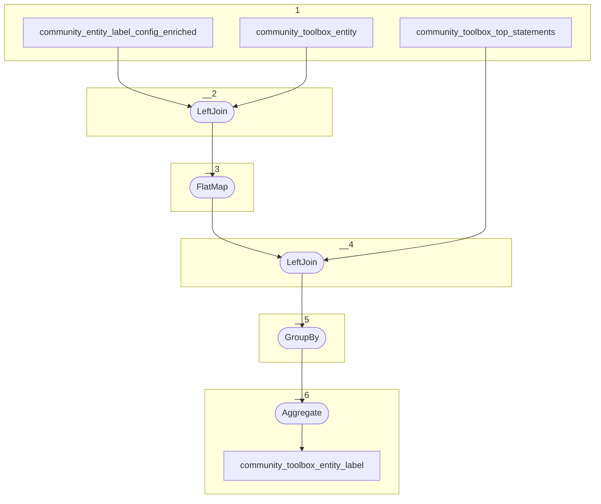

# Topology: CommunityToolboxEntityLabel

This topology generates entity labels by entityId.

| Step |                                                                                                                     |
|------|---------------------------------------------------------------------------------------------------------------------|
| 1    | input topics                                                                                                        |
| 2    | LeftJoin community_toolbox_entity with community_entity_label_config_enriched `class_id` and `community_toolbox_id` |
| 3    | FlatMap create a record for each item in the array of entity label config                                           |
| 4    | LeftJoin on entity_id, community_toolbox_id, property_id, is_outgoing                                               |
| 5    | Group By entity_id, community_toolbox_id                                                                            |
| 6    | Aggregate the label to a comma separate string with max length of 100 characters                                    |

## Input Topics

_{prefix_in} = TS_INPUT_TOPIC_NAME_PREFIX_

_{prefix_out} = TS_OUTPUT_TOPIC_NAME_PREFIX_

| name                                                | label in diagram                       | Type   |
|-----------------------------------------------------|----------------------------------------|--------|
| {prefix_out}_community_entity_label_config_enriched | community_entity_label_config_enriched | KTable |
| {prefix_out}_community_toolbox_entity               | community_toolbox_entity               | KTable |
| {prefix_out}_community_toolbox_top_statements       | community_toolbox_top_statements       | KTable |

## Output topic

| name                                           | label in diagram               |
|------------------------------------------------|--------------------------------|
| {output_prefix}_community_toolbox_entity_label | community_toolbox_entity_label |

## Output model

### Key CommunityToolboxEntityKey

| field                | type   |
|----------------------|--------|
| entity_id            | string |

### Value CommunityToolboxEntityLabelValue

| field                | type          |
|----------------------|---------------|
| entity_id            | string        |
| label                | string        |
| __deleted            | boolean, null |
