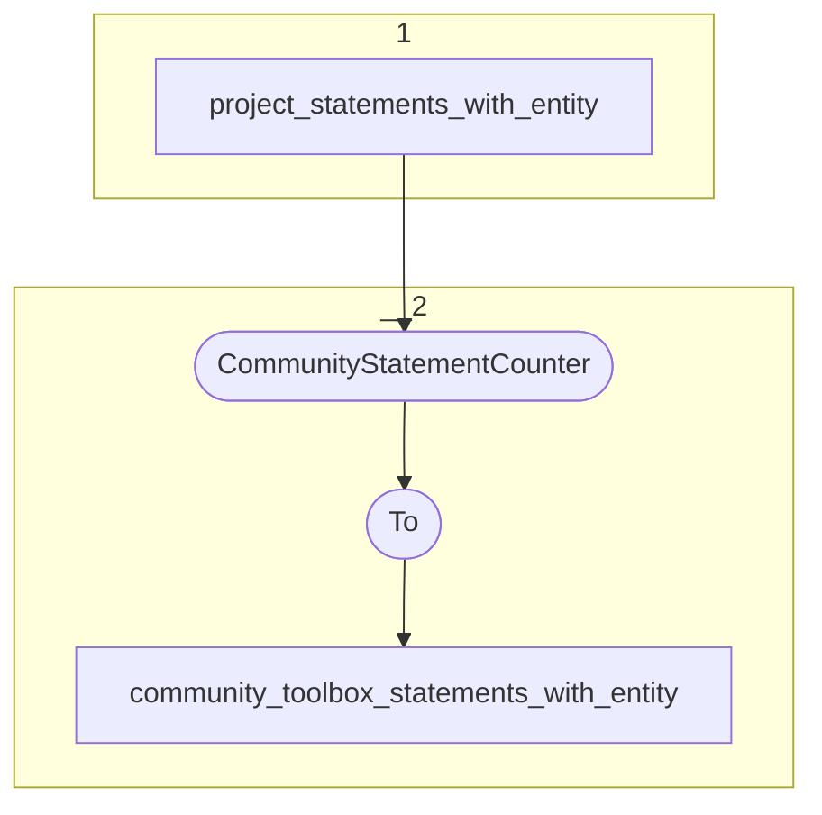

# Topology: CommunityToolboxStatementsWithEntity

This topology generates statements with entities visible for the toolbox community.

| Step |                                                                                                                                     |
|------|-------------------------------------------------------------------------------------------------------------------------------------|
| 1    | input topics                                                                                                                        |
| 2    | CommunityStatementCounter (custom implementation with ProcessorAPI) to count projects per statement, visible for toolbox commmunity |
|      | To topic `community_toolbox_statements_with_entity`                                                                                 |

## Input Topics

_{prefix_out} = TS_OUTPUT_TOPIC_NAME_PREFIX_

| name                            | label in diagram   | Type   |
|---------------------------------|--------------------|--------|
| {prefix_out}_project_statements | project_statements | KTable |

## Output topic

| name                                                     | label in diagram                         |
|----------------------------------------------------------|------------------------------------------|
| {output_prefix}_community_toolbox_statements_with_entity | community_toolbox_statements_with_entity |

## Output model

### Key CommunityStatementKey

| field        | type   |
|--------------|--------|
| statement_id | string |

### Value CommunityStatementValue

| field         | type |
|---------------|------|
| class_id      | int  |
| project_count | int  |
