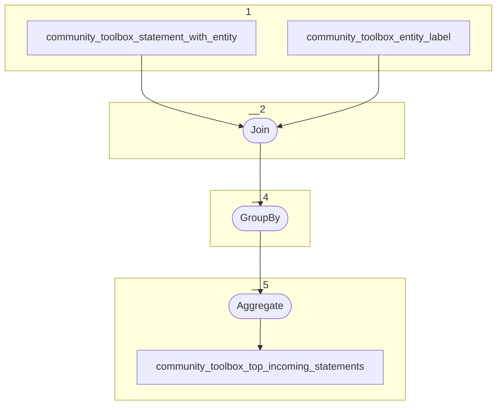

# Topology: CommunityToolboxTopIncomingStatements

This topology aggregates the top 5 incoming statements of an entity's property.

| Step |                                                                     |
|------|---------------------------------------------------------------------|
| 1    | input topic                                                         |
| 3    | Join: entity label to set subject label                             |
| 4    | GroupBy: group by subject_id                                        |
| 5    | Aggregate: create a list of statements, ordered by ord_num_of_range |
|      | To topic `community_toolbox_top_incoming_statements`                |

## Input Topics

_{prefix_in} = TS_INPUT_TOPIC_NAME_PREFIX_

_{prefix_out} = TS_OUTPUT_TOPIC_NAME_PREFIX_

| name                                                 | label in diagram                        | Type    |
|------------------------------------------------------|-----------------------------------------|---------|
| {prefix_out}_community_toolbox_statement_with_entity | community_toolbox_statement_with_entity | KStream |

## Output topic

| name                                                   | label in diagram                          |
|--------------------------------------------------------|-------------------------------------------|
| {prefix_out}_community_toolbox_top_incoming_statements | community_toolbox_top_incoming_statements |

## Output model

### Key

| field                | type    |
|----------------------|---------|
| entity_id            | string  |
| property_id          | int     |
| is_outgoing          | boolean |

### Value

| field       | type                           |
|-------------|--------------------------------|
| entity_id   | string                         |
| project_id  | int                            |
| property_id | int                            |
| is_outgoing | boolean                        |
| statements  | Array<CommunityStatementValue> |
| __deleted   | boolean, null                  |
