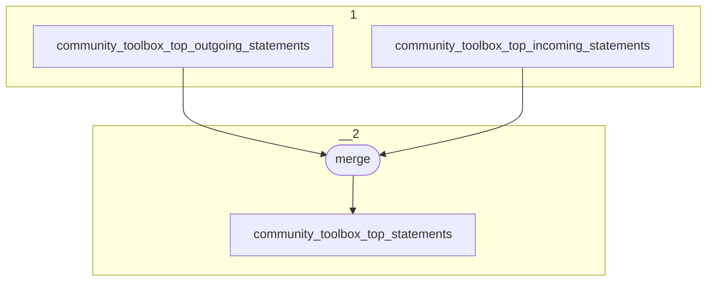

# Topology: CommunityToolboxTopStatements

This topology aggregates the top 5 statements of an entity's field (property+direction).

| Step |                                         |
|------|-----------------------------------------|
| 1    | input topic                             |
| 2    | merge                                   |
|      | To topic `community_toolbox_statements` |

## Input Topics

_{prefix_in} = TS_INPUT_TOPIC_NAME_PREFIX_

_{prefix_out} = TS_OUTPUT_TOPIC_NAME_PREFIX_

| name                                                   | label in diagram                          | Type   |
|--------------------------------------------------------|-------------------------------------------|--------|
| {prefix_out}_community_toolbox_top_outgoing_statements | community_toolbox_top_outgoing_statements | KTable |
| {prefix_out}_community_toolbox_top_incoming_statements | community_toolbox_top_incoming_statements | KTable |

## Output topic

| name                                          | label in diagram                 |
|-----------------------------------------------|----------------------------------|
| {prefix_out}_community_toolbox_top_statements | community_toolbox_top_statements |

## Output model

### Key CommunityToolboxTopStatementsKey

| field                | type    |
|----------------------|---------|
| subject_id           | string  |
| property_id          | int     |
| is_outgoing          | boolean |

### Value CommunityToolboxTopStatementsValue
