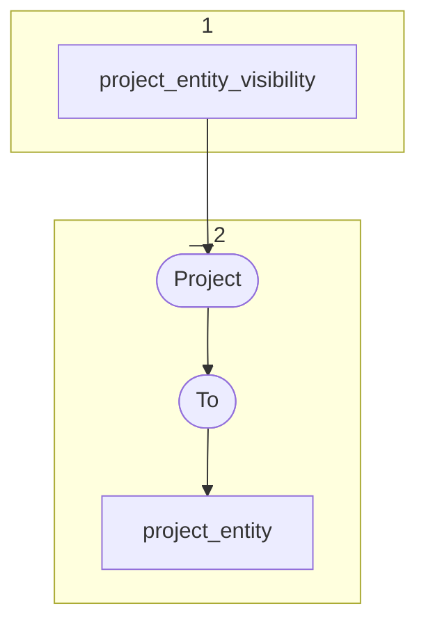

# Topology: ProjectClassLabel

This topology generates project entities.

| Step |                                                            |
|------|------------------------------------------------------------|
| 1    | input topics                                               |
| 2    | Project ProjectEntityVisibilityValue to ProjectEntityValue |
|      | To topic `project_entity`                             |

## Input Topics

_{prefix_in} = TS_INPUT_TOPIC_NAME_PREFIX_

_{prefix_out} = TS_OUTPUT_TOPIC_NAME_PREFIX_

| name                                  | label in diagram | Type   |
|---------------------------------------|------------------|--------|
| {input_prefix}_projects_info_proj_rel | info_proj_rel    | KTable |
| {input_prefix}_information_resource   | resource         | KTable |

## Output topic

| name                           | label in diagram |
|--------------------------------|------------------|
| {output_prefix}_project_entity | project_entity   |

## Output model

| name  | description                             |
|-------|-----------------------------------------|
| Key   | projectId, entityId                     |
| Value | projectId, entityId, classId, __deleted |
