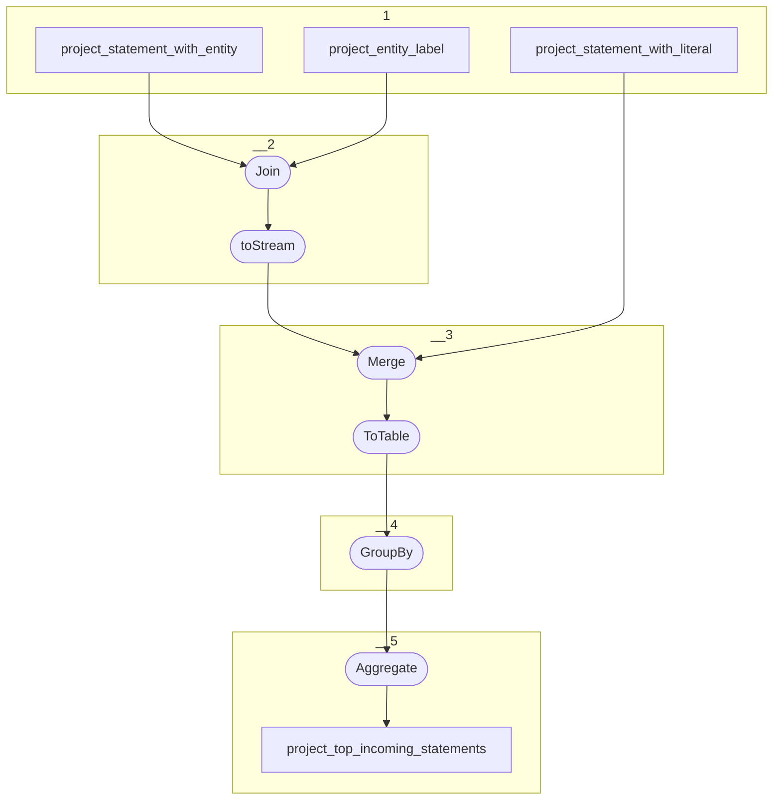

# Topology: ProjectTopOutgoingStatements

This topology aggregates the top 5 outgoing statements of an entity's property.

| Step |                                                                     |
|------|---------------------------------------------------------------------|
| 1    | input topic                                                         |
| 2    | Left Join the entity labels and add the object label.               |
| 3    | GroupBy: group by subject_id                                        |
| 4    | Aggregate: create a list of statements, ordered by ord_num_of_range |
|      | To topic `project_top_outgoing_statements`                          |

## Input Topics

_{prefix_in} = TS_INPUT_TOPIC_NAME_PREFIX_

_{prefix_out} = TS_OUTPUT_TOPIC_NAME_PREFIX_

| name                                        | label in diagram               | Type   |
|---------------------------------------------|--------------------------------|--------|
| {prefix_out}_project_statement_with_literal | project_statement_with_literal | KTable |
| {prefix_out}_project_statement_with_entity  | project_statement_with_entity  | KTable |

## Output topic

| name                                         | label in diagram                |
|----------------------------------------------|---------------------------------|
| {prefix_out}_project_top_outgoing_statements | project_top_outgoing_statements |

## Output model

### Key

| field       | type    |
|-------------|---------|
| entity_id   | string  |
| project_id  | int     |
| property_id | int     |
| is_outgoing | boolean |

### Value

| field       | type                         |
|-------------|------------------------------|
| entity_id   | string                       |
| project_id  | int                          |
| property_id | int                          |
| is_outgoing | boolean                      |
| statements  | Array<ProjectStatementValue> |
| __deleted   | boolean, null                |
