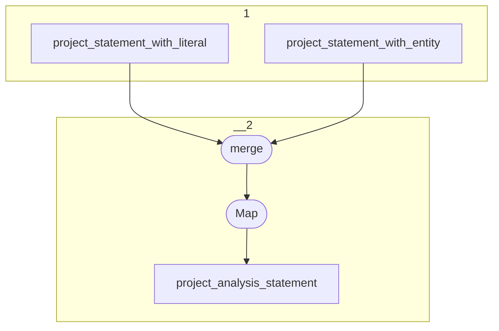

# Topology: ProjectAnalysisStatement

This topology maps ProjectStatements to project ProjectAnalysisStatements,
in order to support the JSON api of the Toolbox analysis section.

| Step |                                                                                  |
|------|----------------------------------------------------------------------------------|
| 1    | input topics                                                                     |
| 2    | merge the two streams and map the incoming messages to ProjectAnalysisStatements |
|      | To topic `project_analysis_statement`                                            |

## Input Topics

_{prefix_out} = TS_OUTPUT_TOPIC_NAME_PREFIX_

| name                                        | label in diagram               | Type    |
|---------------------------------------------|--------------------------------|---------|
| {prefix_out}_project_statement_with_literal | project_statement_with_literal | KStream |
| {prefix_out}_project_statement_with_entity  | project_statement_with_entity  | KStream |

## Output topic

| name                                       | label in diagram           |
|--------------------------------------------|----------------------------|
| {output_prefix}_project_analysis_statement | project_analysis_statement |

## Output model

### Key (AnalysisStatementKey)

| field     | type |
|-----------|------|
| pk_entity | int  |
| project   | int  |

### Value (AnalysisStatementValue)

| field               | type                                                                    |
|---------------------|-------------------------------------------------------------------------|
| pk_entity           | int                                                                     |
| fk_project          | null, int                                                               |
| project             | int                                                                     |
| fk_property         | int                                                                     |
| fk_object_info      | int                                                                     |
| fk_subject_info     | int                                                                     |
| ord_num_of_domain   | int                                                                     |
| ord_num_of_range    | int                                                                     |
| is_in_project_count | int                                                                     |
| object_info_value   | org.geovistory.toolbox.streams.analysis.statements.avro.ObjectInfoValue |