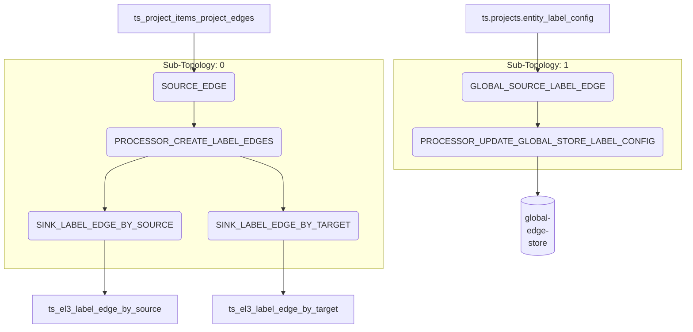

```mermaid
graph TD
ts_project_items_project_edges[ts_project_items_project_edges] --> SOURCE_EDGE(SOURCE_EDGE)
SINK_LABEL_EDGE_BY_SOURCE(SINK_LABEL_EDGE_BY_SOURCE) --> ts_el3_label_edge_by_source[ts_el3_label_edge_by_source]
SINK_LABEL_EDGE_BY_TARGET(SINK_LABEL_EDGE_BY_TARGET) --> ts_el3_label_edge_by_target[ts_el3_label_edge_by_target]
ts.projects.entity_label_config[ts.projects.entity_label_config] --> GLOBAL_SOURCE_LABEL_EDGE(GLOBAL_SOURCE_LABEL_EDGE)
PROCESSOR_UPDATE_GLOBAL_STORE_LABEL_CONFIG(PROCESSOR_UPDATE_GLOBAL_STORE_LABEL_CONFIG) --> global-edge-store[(global-<br>edge-<br>store)]
subgraph Sub-Topology: 0
SOURCE_EDGE(SOURCE_EDGE) --> PROCESSOR_CREATE_LABEL_EDGES(PROCESSOR_CREATE_LABEL_EDGES)
PROCESSOR_CREATE_LABEL_EDGES(PROCESSOR_CREATE_LABEL_EDGES) --> SINK_LABEL_EDGE_BY_SOURCE(SINK_LABEL_EDGE_BY_SOURCE)
PROCESSOR_CREATE_LABEL_EDGES(PROCESSOR_CREATE_LABEL_EDGES) --> SINK_LABEL_EDGE_BY_TARGET(SINK_LABEL_EDGE_BY_TARGET)
end
subgraph Sub-Topology: 1
GLOBAL_SOURCE_LABEL_EDGE(GLOBAL_SOURCE_LABEL_EDGE) --> PROCESSOR_UPDATE_GLOBAL_STORE_LABEL_CONFIG(PROCESSOR_UPDATE_GLOBAL_STORE_LABEL_CONFIG)
end
ts_project_items_project_edges
ts.projects.entity_label_config
ts_el3_label_edge_by_source
ts_el3_label_edge_by_target
global-edge-store
```