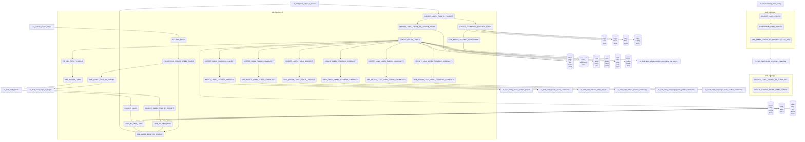

```mermaid
graph TD
ts_3el4_label_edge_by_source[ts_3el4_label_edge_by_source] --> SOURCE_LABEL_EDGE_BY_SOURCE(SOURCE_LABEL_EDGE_BY_SOURCE)
UPDATE_LABEL_EDGES_BY_SOURCE_STORE(UPDATE_LABEL_EDGES_BY_SOURCE_STORE) --> label-edge-by-source-store[(label-<br>edge-<br>by-<br>source-<br>store)]
CREATE_ENTITY_LABELS(CREATE_ENTITY_LABELS) --> entity-publication-store[(entity-<br>publication-<br>store)]
CREATE_ENTITY_LABELS(CREATE_ENTITY_LABELS) --> com-label-count-store[(com-<br>label-<br>count-<br>store)]
CREATE_ENTITY_LABELS(CREATE_ENTITY_LABELS) --> entity-label-store[(entity-<br>label-<br>store)]
CREATE_ENTITY_LABELS(CREATE_ENTITY_LABELS) --> com-label-rank-store[(com-<br>label-<br>rank-<br>store)]
CREATE_ENTITY_LABELS(CREATE_ENTITY_LABELS) --> com-label-lang-rank-store[(com-<br>label-<br>lang-<br>rank-<br>store)]
CREATE_ENTITY_LABELS(CREATE_ENTITY_LABELS) --> label-edge-by-source-store[(label-<br>edge-<br>by-<br>source-<br>store)]
CREATE_ENTITY_LABELS(CREATE_ENTITY_LABELS) --> label-config-tmstp-store[(label-<br>config-<br>tmstp-<br>store)]
ts_p_items_project_edges[ts_p_items_project_edges] --> SOURCE_EDGE(SOURCE_EDGE)
ts_3el4_entity_labels[ts_3el4_entity_labels] --> SOURCE_LABEL(SOURCE_LABEL)
ts_3el4_label_edge_by_target[ts_3el4_label_edge_by_target] --> SOURCE_LABEL_EDGE_BY_TARGET(SOURCE_LABEL_EDGE_BY_TARGET)
CREATE_COMMUNITY_TOOLBOX_EDGES(CREATE_COMMUNITY_TOOLBOX_EDGES) --> edge-sum-store[(edge-<br>sum-<br>store)]
CREATE_COMMUNITY_TOOLBOX_EDGES(CREATE_COMMUNITY_TOOLBOX_EDGES) --> edge-count-store[(edge-<br>count-<br>store)]
CREATE_COMMUNITY_TOOLBOX_EDGES(CREATE_COMMUNITY_TOOLBOX_EDGES) --> edge-bool-store[(edge-<br>bool-<br>store)]
CREATE_COMMUNITY_TOOLBOX_EDGES(CREATE_COMMUNITY_TOOLBOX_EDGES) --> edge-visibility-store[(edge-<br>visibility-<br>store)]
label-edge-by-target-store[(label-<br>edge-<br>by-<br>target-<br>store)] --> JOIN_ON_NEW_EDGE(JOIN_ON_NEW_EDGE)
entity-label-store[(entity-<br>label-<br>store)] --> JOIN_ON_NEW_EDGE(JOIN_ON_NEW_EDGE)
label-edge-by-target-store[(label-<br>edge-<br>by-<br>target-<br>store)] --> JOIN_ON_NEW_LABEL(JOIN_ON_NEW_LABEL)
entity-label-store[(entity-<br>label-<br>store)] --> JOIN_ON_NEW_LABEL(JOIN_ON_NEW_LABEL)
ENTITY_LABEL_TOOLBOX_PROJECT(ENTITY_LABEL_TOOLBOX_PROJECT) --> ts_3el4_entity_labels_toolbox_project[ts_3el4_entity_labels_toolbox_project]
SINK_EDGES_TOOLBOX_COMMUNITY(SINK_EDGES_TOOLBOX_COMMUNITY) --> ts_3el4_label_edges_toolbox_community_by_source[ts_3el4_label_edges_toolbox_community_by_source]
SINK_ENTITY_LABEL(SINK_ENTITY_LABEL) --> ts_3el4_entity_labels[ts_3el4_entity_labels]
SINK_ENTITY_LABEL_PUBLIC_COMMUNITY(SINK_ENTITY_LABEL_PUBLIC_COMMUNITY) --> ts_3el4_entity_labels_public_community[ts_3el4_entity_labels_public_community]
SINK_ENTITY_LABEL_PUBLIC_PROJECT(SINK_ENTITY_LABEL_PUBLIC_PROJECT) --> ts_3el4_entity_labels_public_project[ts_3el4_entity_labels_public_project]
SINK_ENTITY_LABEL_TOOLBOX_COMMUNITY(SINK_ENTITY_LABEL_TOOLBOX_COMMUNITY) --> ts_3el4_entity_labels_toolbox_community[ts_3el4_entity_labels_toolbox_community]
SINK_ENTITY_LANG_LABEL_PUBLIC_COMMUNITY(SINK_ENTITY_LANG_LABEL_PUBLIC_COMMUNITY) --> ts_3el4_entity_language_labels_public_community[ts_3el4_entity_language_labels_public_community]
SINK_ENTITY_LANG_LABEL_TOOLBOX_COMMUNITY(SINK_ENTITY_LANG_LABEL_TOOLBOX_COMMUNITY) --> ts_3el4_entity_language_labels_toolbox_community[ts_3el4_entity_language_labels_toolbox_community]
SINK_LABEL_EDGE_BY_SOURCE(SINK_LABEL_EDGE_BY_SOURCE) --> ts_3el4_label_edge_by_source[ts_3el4_label_edge_by_source]
SINK_LABEL_EDGE_BY_TARGET(SINK_LABEL_EDGE_BY_TARGET) --> ts_3el4_label_edge_by_target[ts_3el4_label_edge_by_target]
ts.projects.entity_label_config[ts.projects.entity_label_config] --> SOURCE_LABEL_CONFIG(SOURCE_LABEL_CONFIG)
SINK_LABEL_CONFIG_BY_PROJECT_CLASS_KEY(SINK_LABEL_CONFIG_BY_PROJECT_CLASS_KEY) --> ts_3el4_label_config_by_project_class_key[ts_3el4_label_config_by_project_class_key]
ts_3el4_label_config_by_project_class_key[ts_3el4_label_config_by_project_class_key] --> SOURCE_LABEL_CONFIG_BY_CLASS_KEY(SOURCE_LABEL_CONFIG_BY_CLASS_KEY)
UPDATE_GLOBAL_STORE_LABEL_CONFIG(UPDATE_GLOBAL_STORE_LABEL_CONFIG) --> global-label-config-store[(global-<br>label-<br>config-<br>store)]
subgraph Sub-Topology: 0
SOURCE_LABEL_EDGE_BY_SOURCE(SOURCE_LABEL_EDGE_BY_SOURCE) --> CREATE_COMMUNITY_TOOLBOX_EDGES(CREATE_COMMUNITY_TOOLBOX_EDGES)
SOURCE_LABEL_EDGE_BY_SOURCE(SOURCE_LABEL_EDGE_BY_SOURCE) --> UPDATE_LABEL_EDGES_BY_SOURCE_STORE(UPDATE_LABEL_EDGES_BY_SOURCE_STORE)
UPDATE_LABEL_EDGES_BY_SOURCE_STORE(UPDATE_LABEL_EDGES_BY_SOURCE_STORE) --> CREATE_ENTITY_LABELS(CREATE_ENTITY_LABELS)
CREATE_ENTITY_LABELS(CREATE_ENTITY_LABELS) --> RE_KEY_ENTITY_LABELS(RE_KEY_ENTITY_LABELS)
CREATE_ENTITY_LABELS(CREATE_ENTITY_LABELS) --> CREATE_LABEL_PUBLIC_COMMUNITY(CREATE_LABEL_PUBLIC_COMMUNITY)
CREATE_ENTITY_LABELS(CREATE_ENTITY_LABELS) --> CREATE_LABEL_PUBLIC_PROJECT(CREATE_LABEL_PUBLIC_PROJECT)
CREATE_ENTITY_LABELS(CREATE_ENTITY_LABELS) --> CREATE_LANG_LABEL_PUBLIC_COMMUNITY(CREATE_LANG_LABEL_PUBLIC_COMMUNITY)
CREATE_ENTITY_LABELS(CREATE_ENTITY_LABELS) --> CREATE_LABEL_TOOLBOX_COMMUNITY(CREATE_LABEL_TOOLBOX_COMMUNITY)
CREATE_ENTITY_LABELS(CREATE_ENTITY_LABELS) --> CREATE_LABEL_TOOLBOX_PROJECT(CREATE_LABEL_TOOLBOX_PROJECT)
CREATE_ENTITY_LABELS(CREATE_ENTITY_LABELS) --> CREATE_LANG_LABEL_TOOLBOX_COMMUNITY(CREATE_LANG_LABEL_TOOLBOX_COMMUNITY)
SOURCE_EDGE(SOURCE_EDGE) --> PROCESSOR_CREATE_LABEL_EDGES(PROCESSOR_CREATE_LABEL_EDGES)
PROCESSOR_CREATE_LABEL_EDGES(PROCESSOR_CREATE_LABEL_EDGES) --> SINK_LABEL_EDGE_BY_SOURCE(SINK_LABEL_EDGE_BY_SOURCE)
PROCESSOR_CREATE_LABEL_EDGES(PROCESSOR_CREATE_LABEL_EDGES) --> SINK_LABEL_EDGE_BY_TARGET(SINK_LABEL_EDGE_BY_TARGET)
SOURCE_LABEL(SOURCE_LABEL) --> JOIN_ON_NEW_LABEL(JOIN_ON_NEW_LABEL)
SOURCE_LABEL_EDGE_BY_TARGET(SOURCE_LABEL_EDGE_BY_TARGET) --> JOIN_ON_NEW_EDGE(JOIN_ON_NEW_EDGE)
CREATE_COMMUNITY_TOOLBOX_EDGES(CREATE_COMMUNITY_TOOLBOX_EDGES) --> SINK_EDGES_TOOLBOX_COMMUNITY(SINK_EDGES_TOOLBOX_COMMUNITY)
CREATE_LABEL_PUBLIC_COMMUNITY(CREATE_LABEL_PUBLIC_COMMUNITY) --> SINK_ENTITY_LABEL_PUBLIC_COMMUNITY(SINK_ENTITY_LABEL_PUBLIC_COMMUNITY)
CREATE_LABEL_PUBLIC_PROJECT(CREATE_LABEL_PUBLIC_PROJECT) --> SINK_ENTITY_LABEL_PUBLIC_PROJECT(SINK_ENTITY_LABEL_PUBLIC_PROJECT)
CREATE_LABEL_TOOLBOX_COMMUNITY(CREATE_LABEL_TOOLBOX_COMMUNITY) --> SINK_ENTITY_LABEL_TOOLBOX_COMMUNITY(SINK_ENTITY_LABEL_TOOLBOX_COMMUNITY)
CREATE_LABEL_TOOLBOX_PROJECT(CREATE_LABEL_TOOLBOX_PROJECT) --> ENTITY_LABEL_TOOLBOX_PROJECT(ENTITY_LABEL_TOOLBOX_PROJECT)
CREATE_LANG_LABEL_PUBLIC_COMMUNITY(CREATE_LANG_LABEL_PUBLIC_COMMUNITY) --> SINK_ENTITY_LANG_LABEL_PUBLIC_COMMUNITY(SINK_ENTITY_LANG_LABEL_PUBLIC_COMMUNITY)
CREATE_LANG_LABEL_TOOLBOX_COMMUNITY(CREATE_LANG_LABEL_TOOLBOX_COMMUNITY) --> SINK_ENTITY_LANG_LABEL_TOOLBOX_COMMUNITY(SINK_ENTITY_LANG_LABEL_TOOLBOX_COMMUNITY)
JOIN_ON_NEW_EDGE(JOIN_ON_NEW_EDGE) --> SINK_LABEL_EDGE_BY_SOURCE(SINK_LABEL_EDGE_BY_SOURCE)
JOIN_ON_NEW_LABEL(JOIN_ON_NEW_LABEL) --> SINK_LABEL_EDGE_BY_SOURCE(SINK_LABEL_EDGE_BY_SOURCE)
RE_KEY_ENTITY_LABELS(RE_KEY_ENTITY_LABELS) --> SINK_ENTITY_LABEL(SINK_ENTITY_LABEL)
end
subgraph Sub-Topology: 1
SOURCE_LABEL_CONFIG(SOURCE_LABEL_CONFIG) --> TRANSFORM_LABEL_CONFIG(TRANSFORM_LABEL_CONFIG)
TRANSFORM_LABEL_CONFIG(TRANSFORM_LABEL_CONFIG) --> SINK_LABEL_CONFIG_BY_PROJECT_CLASS_KEY(SINK_LABEL_CONFIG_BY_PROJECT_CLASS_KEY)
end
subgraph Sub-Topology: 2
SOURCE_LABEL_CONFIG_BY_CLASS_KEY(SOURCE_LABEL_CONFIG_BY_CLASS_KEY) --> UPDATE_GLOBAL_STORE_LABEL_CONFIG(UPDATE_GLOBAL_STORE_LABEL_CONFIG)
end
ts_3el4_label_edge_by_source
ts_p_items_project_edges
ts_3el4_entity_labels
ts_3el4_label_edge_by_target
ts.projects.entity_label_config
ts_3el4_label_config_by_project_class_key
ts_3el4_entity_labels_toolbox_project
ts_3el4_label_edges_toolbox_community_by_source
ts_3el4_entity_labels
ts_3el4_entity_labels_public_community
ts_3el4_entity_labels_public_project
ts_3el4_entity_labels_toolbox_community
ts_3el4_entity_language_labels_public_community
ts_3el4_entity_language_labels_toolbox_community
ts_3el4_label_edge_by_source
ts_3el4_label_edge_by_target
ts_3el4_label_config_by_project_class_key
label-edge-by-source-store
entity-publication-store
com-label-count-store
entity-label-store
com-label-rank-store
com-label-lang-rank-store
label-edge-by-source-store
label-config-tmstp-store
edge-sum-store
edge-count-store
edge-bool-store
edge-visibility-store
label-edge-by-target-store
entity-label-store
label-edge-by-target-store
entity-label-store
global-label-config-store
```