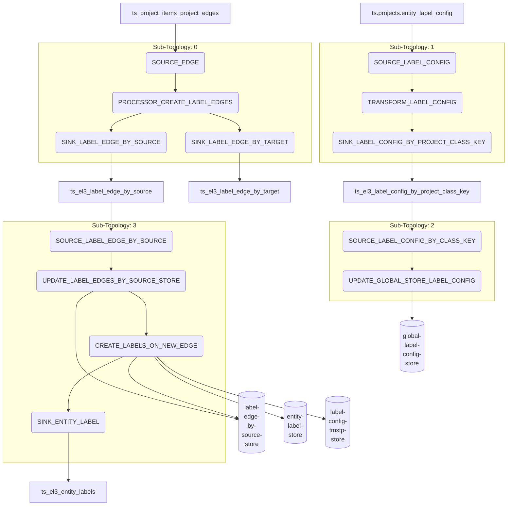

```mermaid
graph TD
ts_project_items_project_edges[ts_project_items_project_edges] --> SOURCE_EDGE(SOURCE_EDGE)
SINK_LABEL_EDGE_BY_SOURCE(SINK_LABEL_EDGE_BY_SOURCE) --> ts_el3_label_edge_by_source[ts_el3_label_edge_by_source]
SINK_LABEL_EDGE_BY_TARGET(SINK_LABEL_EDGE_BY_TARGET) --> ts_el3_label_edge_by_target[ts_el3_label_edge_by_target]
ts.projects.entity_label_config[ts.projects.entity_label_config] --> SOURCE_LABEL_CONFIG(SOURCE_LABEL_CONFIG)
SINK_LABEL_CONFIG_BY_PROJECT_CLASS_KEY(SINK_LABEL_CONFIG_BY_PROJECT_CLASS_KEY) --> ts_el3_label_config_by_project_class_key[ts_el3_label_config_by_project_class_key]
ts_el3_label_config_by_project_class_key[ts_el3_label_config_by_project_class_key] --> SOURCE_LABEL_CONFIG_BY_CLASS_KEY(SOURCE_LABEL_CONFIG_BY_CLASS_KEY)
UPDATE_GLOBAL_STORE_LABEL_CONFIG(UPDATE_GLOBAL_STORE_LABEL_CONFIG) --> global-label-config-store[(global-<br>label-<br>config-<br>store)]
ts_el3_label_edge_by_source[ts_el3_label_edge_by_source] --> SOURCE_LABEL_EDGE_BY_SOURCE(SOURCE_LABEL_EDGE_BY_SOURCE)
UPDATE_LABEL_EDGES_BY_SOURCE_STORE(UPDATE_LABEL_EDGES_BY_SOURCE_STORE) --> label-edge-by-source-store[(label-<br>edge-<br>by-<br>source-<br>store)]
CREATE_LABELS_ON_NEW_EDGE(CREATE_LABELS_ON_NEW_EDGE) --> entity-label-store[(entity-<br>label-<br>store)]
CREATE_LABELS_ON_NEW_EDGE(CREATE_LABELS_ON_NEW_EDGE) --> label-edge-by-source-store[(label-<br>edge-<br>by-<br>source-<br>store)]
CREATE_LABELS_ON_NEW_EDGE(CREATE_LABELS_ON_NEW_EDGE) --> label-config-tmstp-store[(label-<br>config-<br>tmstp-<br>store)]
SINK_ENTITY_LABEL(SINK_ENTITY_LABEL) --> ts_el3_entity_labels[ts_el3_entity_labels]
subgraph Sub-Topology: 0
SOURCE_EDGE(SOURCE_EDGE) --> PROCESSOR_CREATE_LABEL_EDGES(PROCESSOR_CREATE_LABEL_EDGES)
PROCESSOR_CREATE_LABEL_EDGES(PROCESSOR_CREATE_LABEL_EDGES) --> SINK_LABEL_EDGE_BY_SOURCE(SINK_LABEL_EDGE_BY_SOURCE)
PROCESSOR_CREATE_LABEL_EDGES(PROCESSOR_CREATE_LABEL_EDGES) --> SINK_LABEL_EDGE_BY_TARGET(SINK_LABEL_EDGE_BY_TARGET)
end
subgraph Sub-Topology: 1
SOURCE_LABEL_CONFIG(SOURCE_LABEL_CONFIG) --> TRANSFORM_LABEL_CONFIG(TRANSFORM_LABEL_CONFIG)
TRANSFORM_LABEL_CONFIG(TRANSFORM_LABEL_CONFIG) --> SINK_LABEL_CONFIG_BY_PROJECT_CLASS_KEY(SINK_LABEL_CONFIG_BY_PROJECT_CLASS_KEY)
end
subgraph Sub-Topology: 2
SOURCE_LABEL_CONFIG_BY_CLASS_KEY(SOURCE_LABEL_CONFIG_BY_CLASS_KEY) --> UPDATE_GLOBAL_STORE_LABEL_CONFIG(UPDATE_GLOBAL_STORE_LABEL_CONFIG)
end
subgraph Sub-Topology: 3
SOURCE_LABEL_EDGE_BY_SOURCE(SOURCE_LABEL_EDGE_BY_SOURCE) --> UPDATE_LABEL_EDGES_BY_SOURCE_STORE(UPDATE_LABEL_EDGES_BY_SOURCE_STORE)
UPDATE_LABEL_EDGES_BY_SOURCE_STORE(UPDATE_LABEL_EDGES_BY_SOURCE_STORE) --> CREATE_LABELS_ON_NEW_EDGE(CREATE_LABELS_ON_NEW_EDGE)
CREATE_LABELS_ON_NEW_EDGE(CREATE_LABELS_ON_NEW_EDGE) --> SINK_ENTITY_LABEL(SINK_ENTITY_LABEL)
end
ts_project_items_project_edges
ts.projects.entity_label_config
ts_el3_label_config_by_project_class_key
ts_el3_label_edge_by_source
ts_el3_label_edge_by_source
ts_el3_label_edge_by_target
ts_el3_label_config_by_project_class_key
ts_el3_entity_labels
global-label-config-store
label-edge-by-source-store
entity-label-store
label-edge-by-source-store
label-config-tmstp-store
```