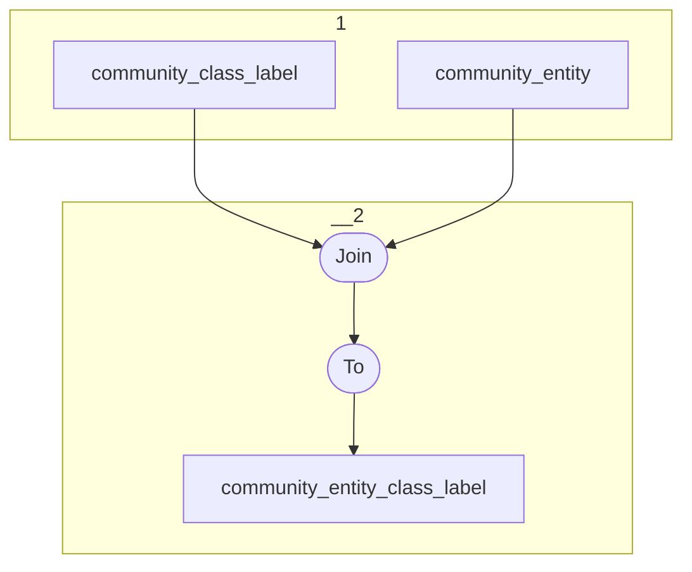

# Topology: CommunityClassLabel

This topology generates class label entities by entityId.

| Step |                                         |
|------|-----------------------------------------|
| 1    | input topics                            |
| 2    | Join on ProjectClassLabelKey            |
|      | To topic `community_entity_class_label` |

## Input Topics

_{prefix_out} = TS_OUTPUT_TOPIC_NAME_PREFIX_

| name                               | label in diagram      | Type   |
|------------------------------------|-----------------------|--------|
| {prefix_out}_community_entity      | community_entity      | KTable |
| {prefix_out}_community_class_label | community_class_label | KTable |

## Output topic

| name                                         | label in diagram             |
|----------------------------------------------|------------------------------|
| {output_prefix}_community_entity_class_label | community_entity_class_label |

## Output model

### Key (ProjectEntityKey)

| field        | type   |
|--------------|--------|
| entity_id    | string |
| community_id | int    |

### Value (ProjectEntityClassLabelValue)

| field        | type          |
|--------------|---------------|
| community_id | int           |
| entity_id    | string        |
| class_id     | int           |
| class_label  | string        |
| __deleted    | boolean, null |