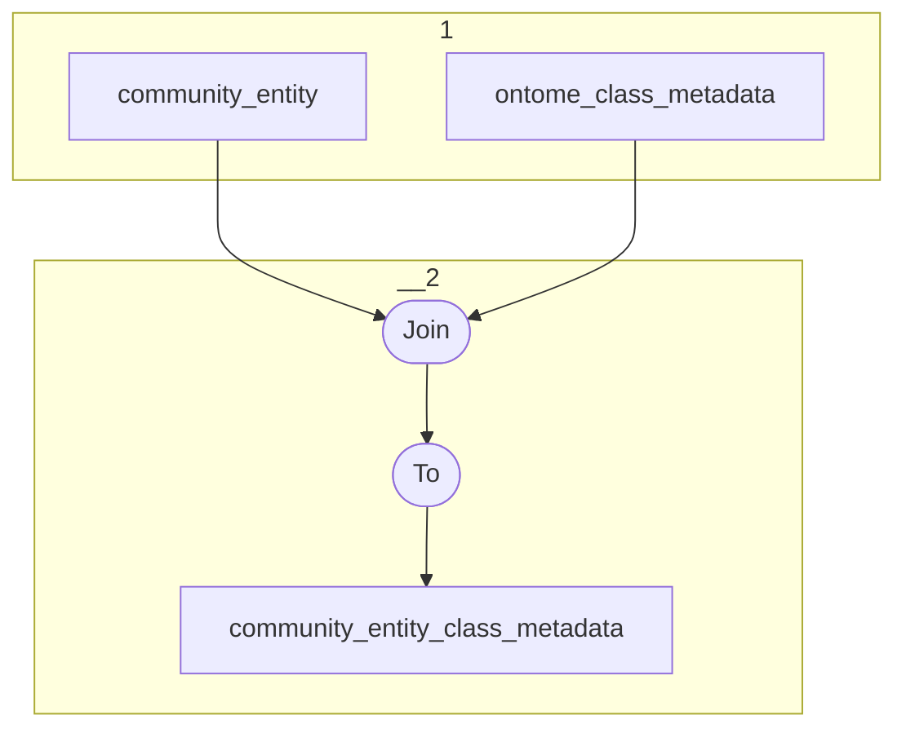

# Topology: Community Entity Class Metadata

This topology joins community entity with class metadata, keyed by CommunityEntityKey.

| Step |                                                                   |
|------|-------------------------------------------------------------------|
| 1    | input topics                                                      |
| 2    | FK-Join on OntomeClassKey, Val: CommunityEntityClassMetadataValue |
|      | To topic `community_entity_class_metadata`                        |

## Input Topics

_{prefix_in} = TS_INPUT_TOPIC_NAME_PREFIX_

| name                                      | label in diagram | Type   |
|-------------------------------------------|------------------|--------|
| {input_prefix}_data_for_history_api_class | api_class        | KTable |

## Output topic

| name                                            | label in diagram                |
|-------------------------------------------------|---------------------------------|
| {output_prefix}_community_entity_class_metadata | community_entity_class_metadata |

## Output model

### Key

| name         | type   |
|--------------|--------|
| entity_id    | string |

### Value

| name             | type        |
|------------------|-------------|
| parent_classes   | int[], null |
| ancestor_classes | int[], null |
