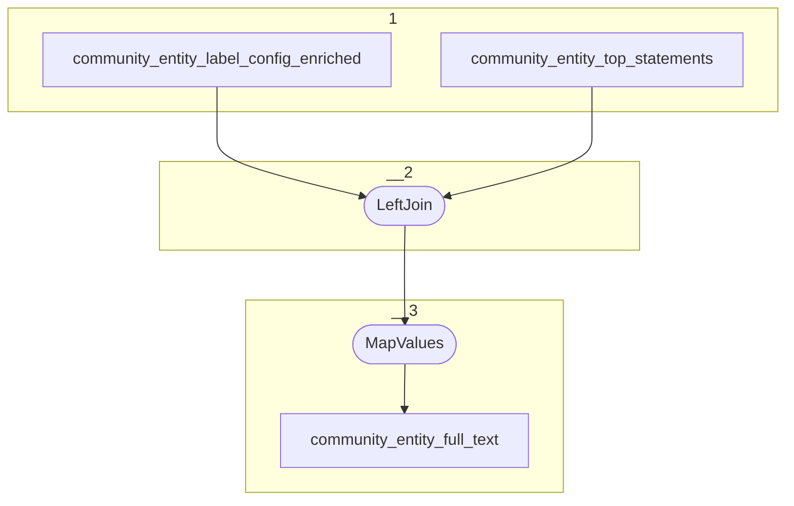

# Topology: ProjectEntityFulltext

This topology generates community entities full text by entityId.

| Step |                                                                                                                      |
|------|----------------------------------------------------------------------------------------------------------------------|
| 1    | input topics                                                                                                         |
| 2    | LeftJoin community_entity_top_statements with community_entity_label_config_enriched `class_id` and `community_id`   |
| 3    | MapValues create full text by joining all top statements. The ones configured by the entity label config come first. |

## Input Topics

_{prefix_in} = TS_INPUT_TOPIC_NAME_PREFIX_

_{prefix_out} = TS_OUTPUT_TOPIC_NAME_PREFIX_

| name                                                | label in diagram                       | Type   |
|-----------------------------------------------------|----------------------------------------|--------|
| {prefix_out}_community_entity_label_config_enriched | community_entity_label_config_enriched | KTable |
| {prefix_out}_community_entity_top_statements        | community_entity_top_statements        | KTable |

## Output topic

| name                                       | label in diagram           |
|--------------------------------------------|----------------------------|
| {output_prefix}_community_entity_full_text | community_entity_full_text |

## Output model

### Key

| field        | type   |
|--------------|--------|
| entity_id    | string |

### Value

| field        | type          |
|--------------|---------------|
| entity_id    | string        |
| full_text    | string        |
| __deleted    | boolean, null |
