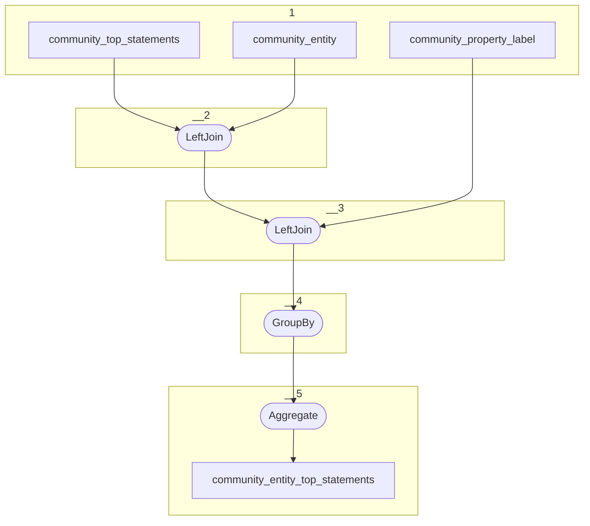

# Topology: CommunityEntityTopStatements

This topology aggregates the top statements of community entities, by entityId.

| Step |                                                                                                                                         |
|------|-----------------------------------------------------------------------------------------------------------------------------------------|
| 1    | input topics                                                                                                                            |
| 2    | LeftJoin join the community entity with the top statements to add the entity class to CommunityTopStatementsWithClass                   |
| 3    | LeftJoin join the property label with the top statements to CommunityTopStatementsWithPropLabelValue                                    |
| 4    | GroupBy CommunityEntityKey                                                                                                              |
| 5    | Aggregate CommunityEntityTopStatementsValue, where the CommunityTopStatementKey is transformed to a string, to be used as key in a map. |

## Input Topics

_{prefix_in} = TS_INPUT_TOPIC_NAME_PREFIX_

_{prefix_out} = TS_OUTPUT_TOPIC_NAME_PREFIX_

| name                                  | label in diagram         | Type   |
|---------------------------------------|--------------------------|--------|
| {prefix_out}_community_top_statements | community_top_statements | KTable |

## Output topic

| name                                            | label in diagram                |
|-------------------------------------------------|---------------------------------|
| {output_prefix}_community_entity_top_statements | community_entity_top_statements |

## Output model

### Key: CommunityEntityKey

| field        | type   |
|--------------|--------|
| entity_id    | string |

### Value CommunityEntityTopStatementsValue

| field        | type                                                  |
|--------------|-------------------------------------------------------|
| entity_id    | string                                                |
| map          | Map<String, CommunityTopStatementsWithPropLabelValue> |
| __deleted    | boolean, null                                         |
