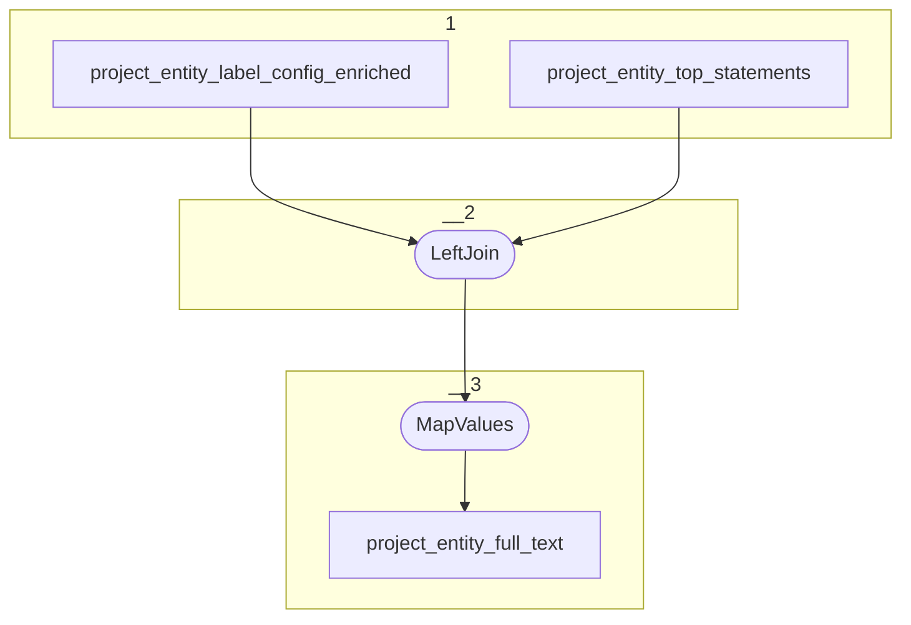

# Topology: ProjectEntityFulltext

This topology generates project entities full text by projectId and entityId.

| Step |                                                                                               |
|------|-----------------------------------------------------------------------------------------------|
| 1    | input topics                                                                                  |
| 2    | LeftJoin project_entity_top_statements with project_entity_label_config_enriched `class_id` and `project_id` |
| 3    | MapValues create full text by joining all top statements. The ones configured by the entity label config come first.                     |

## Input Topics

_{prefix_in} = TS_INPUT_TOPIC_NAME_PREFIX_

_{prefix_out} = TS_OUTPUT_TOPIC_NAME_PREFIX_

| name                                              | label in diagram                     | Type   |
|---------------------------------------------------|--------------------------------------|--------|
| {prefix_out}_project_entity_label_config_enriched | project_entity_label_config_enriched | KTable |
| {prefix_out}_project_entity_top_statements                       | project_entity_top_statements                       | KTable |

## Output topic

| name                                 | label in diagram     |
|--------------------------------------|----------------------|
| {output_prefix}_project_entity_full_text | project_entity_full_text |

## Output model

### Key

| field      | type   |
|------------|--------|
| project_id | int    |
| entity_id  | string |

### Value

| field      | type          |
|------------|---------------|
| project_id | int           |
| entity_id  | string        |
| full_text      | string        |
| __deleted  | boolean, null |
