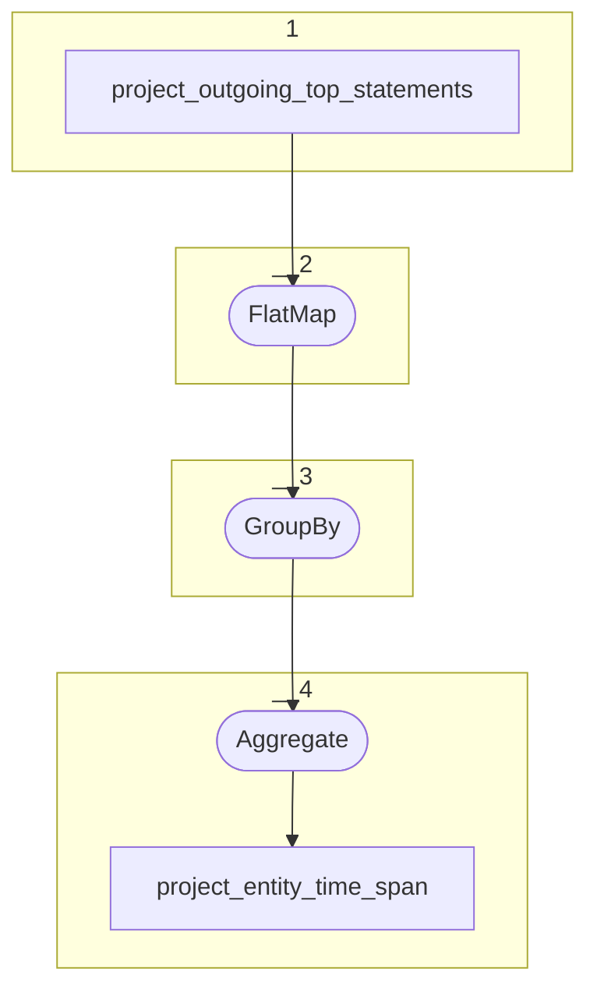

# Topology: ProjectEntityTimeSpan

This topology aggregates entity time span.

| Step |                                                                                 |
|------|---------------------------------------------------------------------------------|
| 1    | input topic                                                                     |
| 2    | FlatMap: Map statements of time properties to time primitives, suppress others. |
| 3    | GroupBy: Entity                                                                 |
| 4    | Aggregate: To Time Span Value                                                   |
|      | To topic `project_entity_time_span`                                             |

## Input Topics

_{prefix_in} = TS_INPUT_TOPIC_NAME_PREFIX_

_{prefix_out} = TS_OUTPUT_TOPIC_NAME_PREFIX_

| name                                       | label in diagram              | Type    |
|--------------------------------------------|-------------------------------|---------|
| {prefix_out}_project_entity_top_statements | project_entity_top_statements | KStream |

## Output topic

| name                                  | label in diagram         |
|---------------------------------------|--------------------------|
| {prefix_out}_project_entity_time_span | project_entity_time_span |

## Output model

### Key

| field      | type   |
|------------|--------|
| project_id | int    |
| entity_id  | string |

### Value

| field       | type          |
|-------------|---------------|
| timeSpan    | TimeSpan      |
| firstSecond | long          |
| lastSecond  | long          |
| __deleted   | boolean, null |

### TimeSpan

| field | type          |
|-------|---------------|
| p81   | TimePrimitive |
| p82   | TimePrimitive |
| p81a  | TimePrimitive |
| p81b  | TimePrimitive |
| p82a  | TimePrimitive |
| p82b  | TimePrimitive |

### TimePrimitive

| field | type |
| --- | --- |
| julianDay | long |
| duration | string |
| calendar | string |