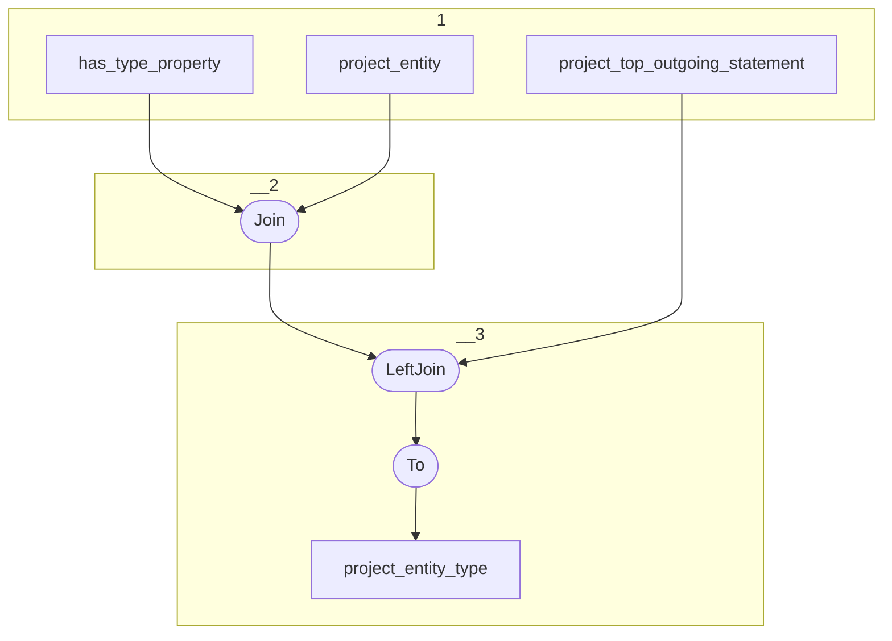

# Topology: ProjectEntityType

This topology generates property ids for has type sub-properties, grouped by domain class.

| Step |                                                        |
|------|--------------------------------------------------------|
| 1    | input topics                                           |
| 2    | Join project entity with has type property on class id |
| 3    | Join project entity has type with statements           |

## Input Topics

_{prefix_in} = TS_INPUT_TOPIC_NAME_PREFIX_

_{prefix_out} = TS_OUTPUT_TOPIC_NAME_PREFIX_

| name                                         | label in diagram | Type   |
|----------------------------------------------|------------------|--------|
| {input_prefix}_data_for_history_api_property | api_property     | KTable |

## Output topic

| name                              | label in diagram  |
|-----------------------------------|-------------------|
| {output_prefix}_has_type_property | has_type_property |

## Output model

### Key: ProjectEntityKey

| field      | type   |
|------------|--------|
| project_id | int    |
| entity_id  | string |

### Value: ProjectEntityTypeValue

| field      | type          |
|------------|---------------|
| project_id | int           |
| entity_id  | string        |
| type_id    | string        |
| type_label | string        |
| __deleted  | boolean, null |