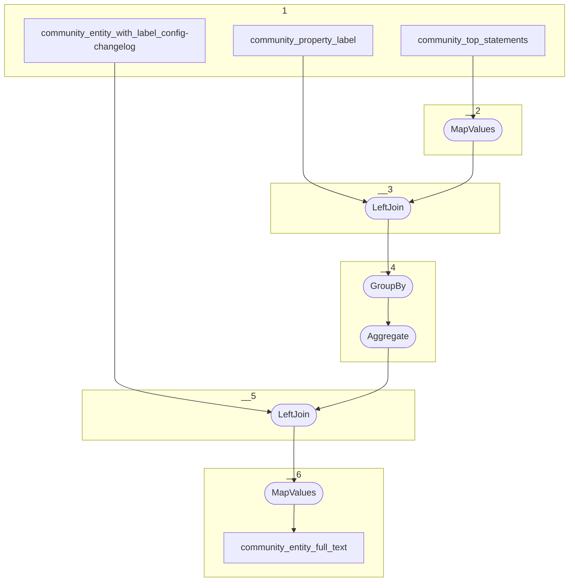

# Topology: ProjectEntityFulltext

This topology generates community entities full text by communityId and entityId.

| Step |                                                 |
|------|-------------------------------------------------|
| 1    | input topics                                    |
| 2    | MapValues: Convert top statements to top labels |
| 3    | LeftJoin PropertyLabel                          |
| 4    | GroupBy ProjectEntityKey                        |
| 4    | Aggregate EntityFulltextsMap                    |
| 5    | LeftJoin community_entity_label_config_enriched |
| 6    | MapValues Create fulltext                       |

## Input Topics

_{prefix_in} = TS_INPUT_TOPIC_NAME_PREFIX_

_{prefix_out} = TS_OUTPUT_TOPIC_NAME_PREFIX_

| name                                                | label in diagram                       | Type   |
|-----------------------------------------------------|----------------------------------------|--------|
| {prefix_out}_community_entity_label_config_enriched | community_entity_label_config_enriched | KTable |
| {prefix_out}_community_entity_top_statements        | community_entity_top_statements        | KTable |

## Output topic

| name                                       | label in diagram           |
|--------------------------------------------|----------------------------|
| {output_prefix}_community_entity_full_text | community_entity_full_text |

## Output model

### Key

| field        | type   |
|--------------|--------|
| entity_id    | string |

### Value

| field        | type          |
|--------------|---------------|
| entity_id    | string        |
| full_text    | string        |
| __deleted    | boolean, null |
