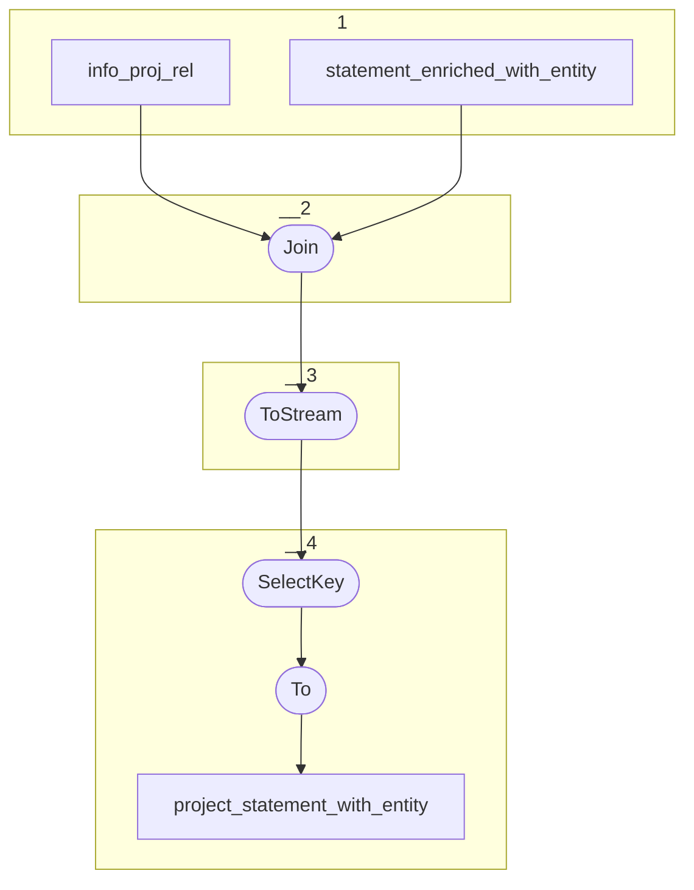

# Topology: ProjectStatement

This topology generates project entities by projectId and statementId.

| Step |                                                                    |
|------|--------------------------------------------------------------------|
| 1    | input topics                                                       |
| 2    | Join on foreign key info_proj_rel.fk_entity = project_statement.id |
| 3    | To stream                                                          |
| 4    | SelectKey: Select ProjectStatementKey                              |
|      | To topic `project_statement_with_entity`                           |

## Input Topics

_{prefix_in} = TS_INPUT_TOPIC_NAME_PREFIX_

_{prefix_out} = TS_OUTPUT_TOPIC_NAME_PREFIX_

| name                                       | label in diagram              | Type   |
|--------------------------------------------|-------------------------------|--------|
| {input_prefix}_projects_info_proj_rel      | info_proj_rel                 | KTable |
| {prefix_out}_project_statement_with_entity | project_statement_with_entity | KTable |

## Output topic

| name                              | label in diagram  |
|-----------------------------------|-------------------|
| {output_prefix}_project_statement | project_statement |

## Output model

| name  | description                                  |
|-------|----------------------------------------------|
| Key   | projectId, statementId                       |
| Value | projectId, statementId, Statement, __deleted |

### Key

| field       | type |
|-------------|------|
| projectId   | int  |
| statementId | int  |

### Value

| field         | type                            |
|---------------|---------------------------------|
| projectId     | int                             |
| statementId   | int                             |
| statement     | StatementEnrichedValue          |
| created_by    | int                             |
| created_at    | io.debezium.time.ZonedTimestamp |
| modified_at   | io.debezium.time.ZonedTimestamp |
| is_in_project | boolean                         |
| __deleted     | boolean, null                   |
