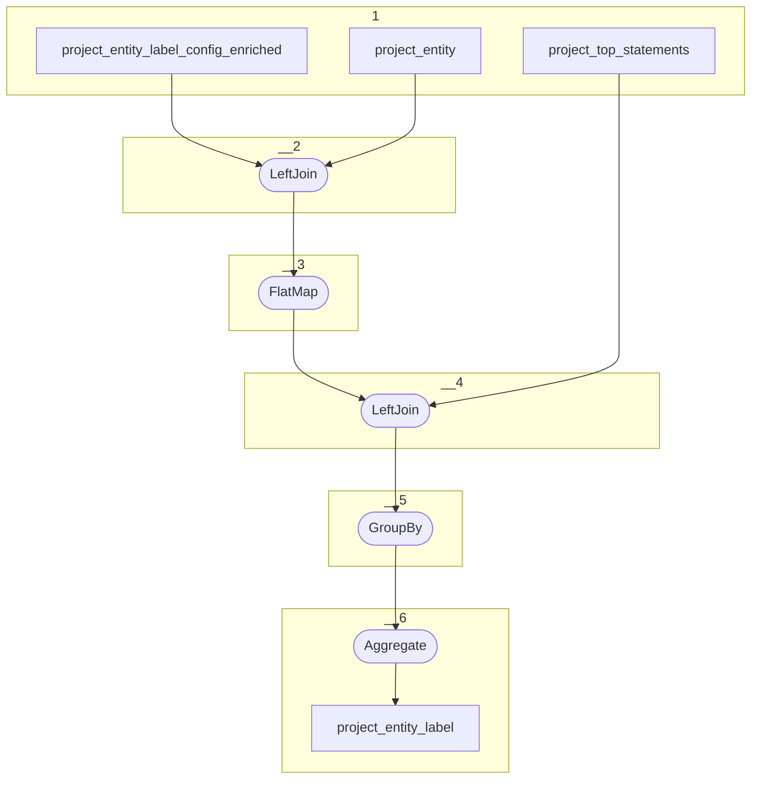

# Topology: ProjectEntityLabel

This topology generates project entities by projectId and entityId.

| Step |                                                                                               |
|------|-----------------------------------------------------------------------------------------------|
| 1    | input topics                                                                                  |
| 2    | LeftJoin project_entity with project_entity_label_config_enriched `class_id` and `project_id` |
| 3    | FlatMap create a record for each item in the array of entity label config                     |
| 4    | LeftJoin on entity_id, project_id, property_id, is_outgoing                                   |
| 5    | Group By entity_id, project_id                                                                |
| 6    | Aggregate the label to a comma separate string with max length of 100 characters              |

## Input Topics

_{prefix_in} = TS_INPUT_TOPIC_NAME_PREFIX_

_{prefix_out} = TS_OUTPUT_TOPIC_NAME_PREFIX_

| name                                              | label in diagram                     | Type   |
|---------------------------------------------------|--------------------------------------|--------|
| {prefix_out}_project_entity_label_config_enriched | project_entity_label_config_enriched | KTable |
| {prefix_out}_project_entity                       | project_entity                       | KTable |
| {prefix_out}_project_top_statements               | project_top_statements               | KTable |

## Output topic

| name                                 | label in diagram     |
|--------------------------------------|----------------------|
| {output_prefix}_project_entity_label | project_entity_label |

## Output model

### Key

| field      | type   |
|------------|--------|
| project_id | int    |
| entity_id  | string |

### Value

| field      | type          |
|------------|---------------|
| project_id | int           |
| entity_id  | string        |
| label      | string        |
| __deleted  | boolean, null |
