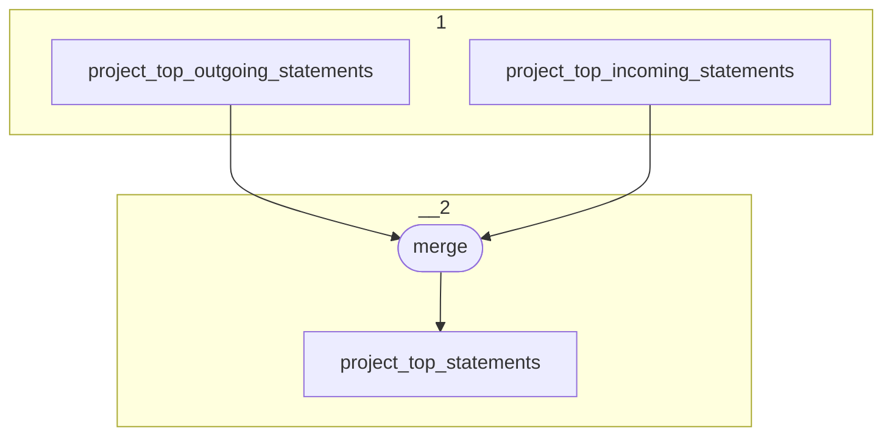

# Topology: ProjectTopStatements

This topology aggregates the top 5 statements of an entity's field (property+direction).

| Step |                               |
|------|-------------------------------|
| 1    | input topic                   |
| 2    | merge                         |
|      | To topic `project_statements` |

## Input Topics

_{prefix_in} = TS_INPUT_TOPIC_NAME_PREFIX_

_{prefix_out} = TS_OUTPUT_TOPIC_NAME_PREFIX_

| name                                         | label in diagram                | Type   |
|----------------------------------------------|---------------------------------|--------|
| {prefix_out}_project_top_outgoing_statements | project_top_outgoing_statements | KTable |
| {prefix_out}_project_top_incoming_statements | project_top_incoming_statements | KTable |

## Output topic

| name                                | label in diagram       |
|-------------------------------------|------------------------|
| {prefix_out}_project_top_statements | project_top_statements |

## Output model

### Key

| field       | type    |
|-------------|---------|
| project_id  | int     |
| subject_id  | string  |
| property_id | int     |
| is_outgoing | boolean |

### Value

| field       | type                         |
|-------------|------------------------------|
| project_id  | int                          |
| subject_id  | string                       |
| property_id | int                          |
| is_outgoing | boolean                      |
| statements  | Array<ProjectStatementValue> |
| __deleted   | boolean, null                |
