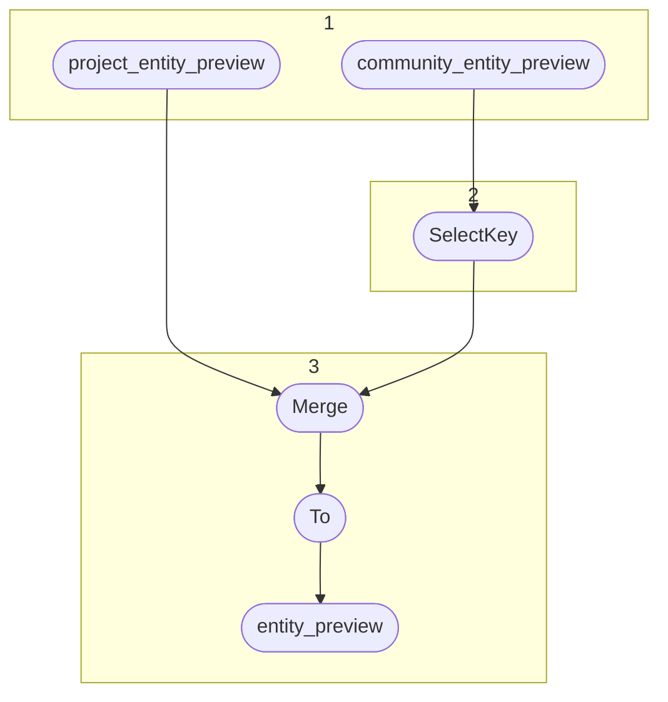

# Topology: EntityPreview

| Step |                                               |
|------|-----------------------------------------------|
| 1    | input topics                                  |
| 2    | Select Key: ProjectEntityKey with projectId=0 |
| 3    | merge and materialize to output topic         |

## Input Topics

_{prefix_out} = TS_OUTPUT_TOPIC_NAME_PREFIX_

| name                                  | label in diagram         | Type    |
|---------------------------------------|--------------------------|---------|
| {prefix_out}_project_entity_preview   | project_entity_preview   | KStream |
| {prefix_out}_community_entity_preview | community_entity_preview | KStream |

## Output topic

| name                           | label in diagram |
|--------------------------------|------------------|
| {output_prefix}_entity_preview | entity_preview   |

## Output model

### Key: ProjectEntityKey

| field      | type   |
|------------|--------|
| project_id | int    |
| entity_id  | string |

### Value: EntityPreviewValue

| field        | type          |
|--------------|---------------|
| fk_project   | int, null     |
| project      | int           |
| pk_entity    | string        |
| fk_class     | int, null     |
| fk_type      | string, null  |
| entity_label | string, null  |
| class_label  | string, null  |
| type_label   | string, null  |
| entity_type  | string, null  |
| full_text    | string        |
| time_span    | string, null  |
| first_second | bigint, null  |
| last_second  | bigint, null  |
| __deleted    | boolean, null |