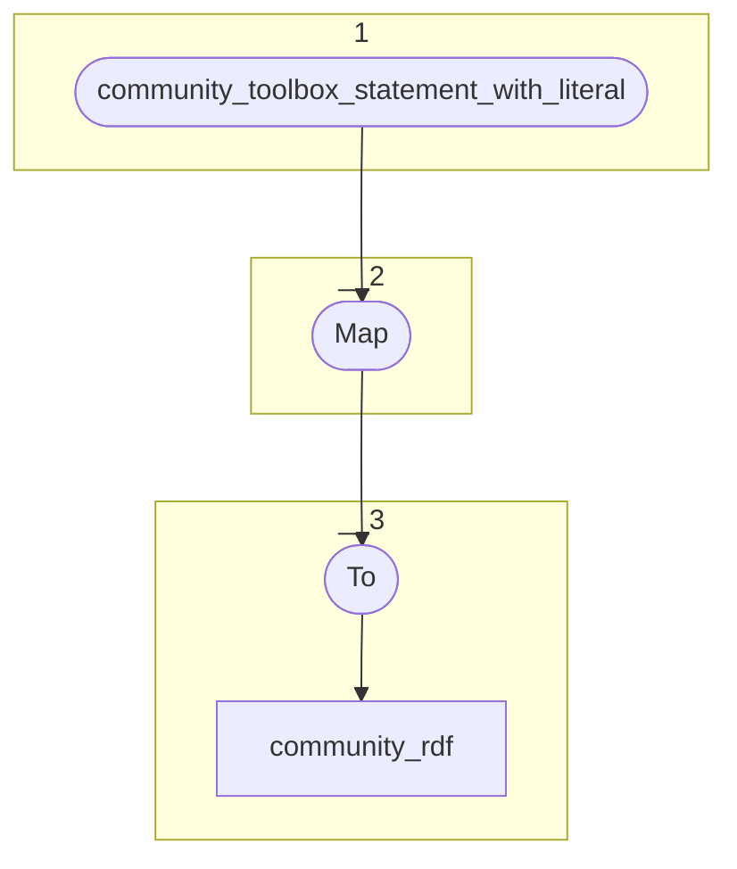

# Topology: CommunityStatementToLiteral

| Step |                                                                                                                  |
|------|------------------------------------------------------------------------------------------------------------------|
| 1    | input topics                                                                                                     |
| 2    | Map each input CommunityStatementKey-CommunityStatementValue-record to two ProjectRdfKey-ProjectRdfValue-records |
|      | one with subject, predicate, object and the inversed one with object, predicate+i, subject                       |
| 3    | To output topic community_rdf                                                                                    |

## Input Topics

_{prefix_out} = TS_OUTPUT_TOPIC_NAME_PREFIX_

| name                                                  | label in diagram                         | Type    |
|-------------------------------------------------------|------------------------------------------|---------|
| {prefix_out}_community_toolbox_statement_with_literal | community_toolbox_statement_with_literal | KStream |

## Output topic

| name                          | label in diagram |
|-------------------------------|------------------|
| {output_prefix}_community_rdf | community_rdf    |

## Output model

### Key: ProjectRdfKey

| field      | type                |
|------------|---------------------|
| project_id | int (here always 0) |
| turtle     | string              |

### Value: ProjectRdfValue

| field     | type                    |
|-----------|-------------------------|
| operation | enum["insert","delete"] |

## RDF serialization

The mapping input records to output records is identical to ProjectStatementToLiteral with one exception:
The projectId in ProjectRdfKey has to be always 0.

It makes sense to extract some code from ProjectStatementToLiteral (e.g. L69-169) into a shared class, used by
ProjectStatementToLiteral and CommunityStatementToLiteral.