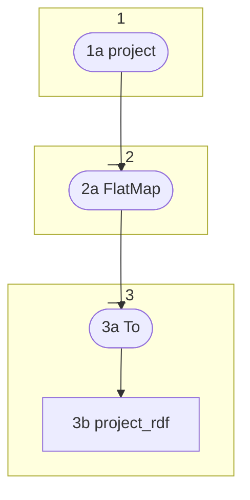

# Topology: ProjectCustomRdfsLabels

This topology produces custom rdfs:label for all projects, that are needed to properly display labels of auto generated
classes and properties (since their labels are not provided by ontome).



1a) Create a KStream from `{dev/stag/prod}.projects.project`

2a) FlatMap the records to `ProjectRdfKey` and `ProjectRdfValue` to these triples:

```turtle
<http://www.w3.org/1999/02/22-rdf-syntax-ns#type> <http://www.w3.org/2000/01/rdf-schema#label> "has type"@en .
<http://www.w3.org/2000/01/rdf-schema#label> <http://www.w3.org/2000/01/rdf-schema#label> "has label"@en .
<http://www.w3.org/2002/07/owl#sameAs> <http://www.w3.org/2000/01/rdf-schema#label> "same as"@en . 

<https://ontome.net/ontology/c50> <http://www.w3.org/2000/01/rdf-schema#label> "Time-Span"@en .
<https://ontome.net/ontology/c50> a <http://www.w3.org/2002/07/owl#Class> .
<https://ontome.net/ontology/p4> <http://www.w3.org/2000/01/rdf-schema#label> "has time-span"@en .
<https://ontome.net/ontology/p4i> <http://www.w3.org/2000/01/rdf-schema#label> "is time-span of"@en .

<http://www.w3.org/2006/time#DateTimeDescription> <http://www.w3.org/2000/01/rdf-schema#label> "Date-Time description"@en .
<http://www.w3.org/2006/time#hasTRS> <http://www.w3.org/2000/01/rdf-schema#label> "Temporal reference system used"@en .
<http://www.w3.org/2006/time#unitType> <http://www.w3.org/2000/01/rdf-schema#label> "temporal unit type"@en .
<http://www.w3.org/2006/time#year> <http://www.w3.org/2000/01/rdf-schema#label> "Year"@en .
<http://www.w3.org/2006/time#month> <http://www.w3.org/2000/01/rdf-schema#label> "Month"@en .
<http://www.w3.org/2006/time#day> <http://www.w3.org/2000/01/rdf-schema#label> "Day"@en .
<http://www.w3.org/2006/time#unitYear> <http://www.w3.org/2000/01/rdf-schema#label> "Year (unit of temporal duration)"@en .
<http://www.w3.org/2006/time#unitMonth> <http://www.w3.org/2000/01/rdf-schema#label> "Month (unit of temporal duration)"@en .
<http://www.w3.org/2006/time#unitDay> <http://www.w3.org/2000/01/rdf-schema#label> "Day (unit of temporal duration)"@en .

<http://www.opengis.net/def/uom/ISO-8601/0/Gregorian> <http://www.w3.org/2000/01/rdf-schema#label> "Gregorian Calendar"@en .
<https://d-nb.info/gnd/4318310-4> <http://www.w3.org/2000/01/rdf-schema#label> "Julian Calendar"@en .
```

3a) To: sink it to `project_rdf`

