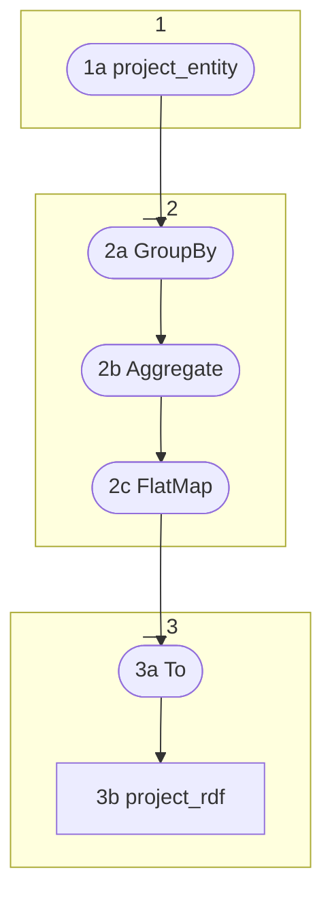

# Topology: ProjectEntityRdfsLabel

This topology produces rdf:type triples for all project entities.

It does so by reading the input topic `project_entity`.

The challenge is to handle the update of an entity's type:
An update needs to be converted into an delete and an insert statement.



1a) Create a KStream from `project_entity`

2a) GroupBy `ProjectEntityKey`

2b) Aggregate the old and new value to a `ProjectRdfList`

`ProjectRdfList` has a field `items` of type array. The items in the array are of type `ProjectRdfRecord`.

`ProjectRdfRecord`:

- key ProjectRdfKey
- value ProjectRdfValue`

If the old value is not null and the old value is different from the new value,
add to `ProjectRdfList.items` a `KeyValue<ProjectRdfKey,ProjectRdfValue>.pair()` with
operation `delete` and the triple:

```turtle
<http://geovistory.org/resource/{entityId}> <http://www.w3.org/1999/02/22-rdf-syntax-ns#type> <https://ontome.net/ontology/c{classId}> .
```

For the new value, add to `ProjectRdfList.items` a `KeyValue<ProjectRdfKey,ProjectRdfValue>.pair()` with
the triple:

```turtle
<http://geovistory.org/resource/{entityId}> <http://www.w3.org/1999/02/22-rdf-syntax-ns#type> <https://ontome.net/ontology/c{classId}> .
```

Depending on the new values delete flag, operation is `insert` or `delete`.

2b) FlatMap the records of `ProjectRdfList.items`.

3a) To: sink it to `project_rdf`

