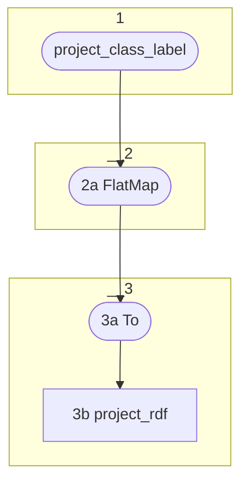

# Topology: ProjectOwlClasses

This topology produces triples about the ontology using the Web Ontology Language OWL.

It does so by adding a label for the class URI's, as they are provided by `project_class_label`.




2a) FlatMap the records of `project_class_label` to `ProjectRdfKey` and `ProjectRdfValue` to
these triples:

```turtle
<https://ontome.net/ontology/c{id}> a <http://www.w3.org/2002/07/owl#Class> .
<https://ontome.net/ontology/c{id}> <http://www.w3.org/2000/01/rdf-schema#label> "CLASSLABEL"@lang .
```

In the CLASSLABEL: Escape `\` and `"`  with another `\`.

Example `The "foo\bar"` -> `The \"foo\\bar\"`

The @lang is derived from the ProjectClassLabelValue.languageIso.
In case ProjectClassLabelValue.languageIso is null, type the literal as xsd:string:

```
<https://ontome.net/ontology/c{id}> <http://www.w3.org/2000/01/rdf-schema#label> "CLASSLABEL"^^<http://www.w3.org/2001/XMLSchema#string> .
```

In case ProjectClassLabelValue.getDeleted$() is true, set the operation to 'delete', else to 'insert'.

### 5: Sink

3a) To: sink it to `project_rdf`

