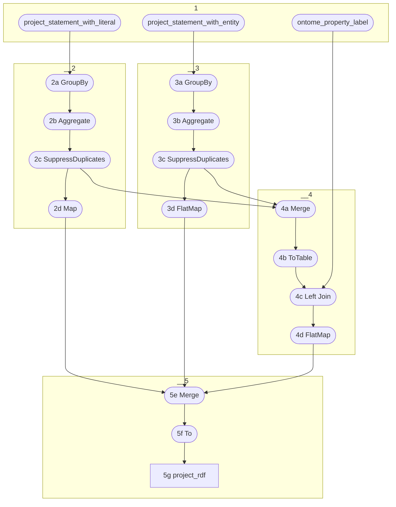

# Topology: ProjectOwlProperties

This topology produces triples about the ontology using the Web Ontology Language OWL.

It does so by further describing the predicates as they
are produced by`ProjectStatementToLiteral` and `ProjectStatementToUri`.

OWL distinguishes between two main categories of properties that an ontology builder may want to define:

- owl:ObjectProperty: Object properties link individuals to individuals.
- owl:DatatypeProperty: Datatype properties link individuals to data values (=literals).

This distinction is reflected by the two topics `project_statement_with_literal` and `project_statement_with_entity`.

In addition, it adds labels to the properties as provided by topic `ontome_property_label`.



### 2: OWL Datatype Property

2a) Group a stream of `project_statement_with_literal` by `ProjectOwlPropertyKey`
`ProjectOwlPropertyKey`: project id (int) and property id 'p123' (string)

2b) Aggregate KGroupedStream to stream with `ProjectOwlPropertyValue`: type='d' (for datatype property).

2c) Suppress duplicates (e.g. using `.transform(new IdenticalRecordsFilterSupplier())`)

2d) Map to `ProjectRdfKey` and `ProjectRdfValue`, with insert operations and this triple:

```turtle
<https://ontome.net/ontology/p{id}> a <http://www.w3.org/2002/07/owl#DatatypeProperty> .
```

### 3: OWL Object Property

3a) Group the stream of `project_statement_with_entity` by `ProjectOwlPropertyKey`
`ProjectOwlPropertyKey`: project id (int) and property id ('p123') (string)

3b) Aggregate KGroupedStream to stream with `ProjectOwlPropertyValue`:  type='o' (for object property)

3c) Suppress duplicates (e.g. using `.transform(new IdenticalRecordsFilterSupplier())`)

3d) FlatMap to `ProjectRdfKey` and `ProjectRdfValue`, with insert operations and these triples:

```turtle
<https://ontome.net/ontology/p{id}> a <http://www.w3.org/2002/07/owl#ObjectProperty> .
<https://ontome.net/ontology/p{id}i> a <http://www.w3.org/2002/07/owl#ObjectProperty> .
<https://ontome.net/ontology/p{id}i> <http://www.w3.org/2002/07/owl#inverseOf> <https://ontome.net/ontology/p{id}> .
```

### 4: Labels

4a) Merge the streams of 2c and 3c

4b) ToTable, convert stream into a table

4c) Join the english ontome property using a foreign key join, creating `ProjectOwlPropertyLabelValue`:
label (string), inverse_label (string, null)

Set inverse label to null for all datatype properties.

4d) FlatMap to `ProjectRdfKey` and `ProjectRdfValue`, with insert operations and these triples:

If label is not null:

```turtle
<https://ontome.net/ontology/p2> <http://www.w3.org/2000/01/rdf-schema#label> "has type"@en .
```

If inverse_label is not null:

```turtle
<https://ontome.net/ontology/p2i> <http://www.w3.org/2000/01/rdf-schema#label> "is type of"@en .
```

label can be null, if the ontome label is null
reverse_label can be null, if the ontome reverse label is null or if the property is a datatype property

### 5: Sink

5a) Merge 4a/b/c

5b) To: sink it to `project_rdf`

## Performance considerations

The input topics `project_statement_with_entity` and `project_statement_with_literal`
are large topics. By grouping them (see 2a and 3a), the amount of messages needed downstream is considerably lower than
upstream. Therefore, is important to only push messages downstream, if there is a new project-predicate arriving (see 2c
and 3c).

This way we avoid a lot of unnecessary writes to the output topics and work on joining
the labels.

We don't need to handle deletes. In case a project removes all statements of a predicate, the RDF will still contain the
owl property and its label. This does no harm and allows to increase performance.

