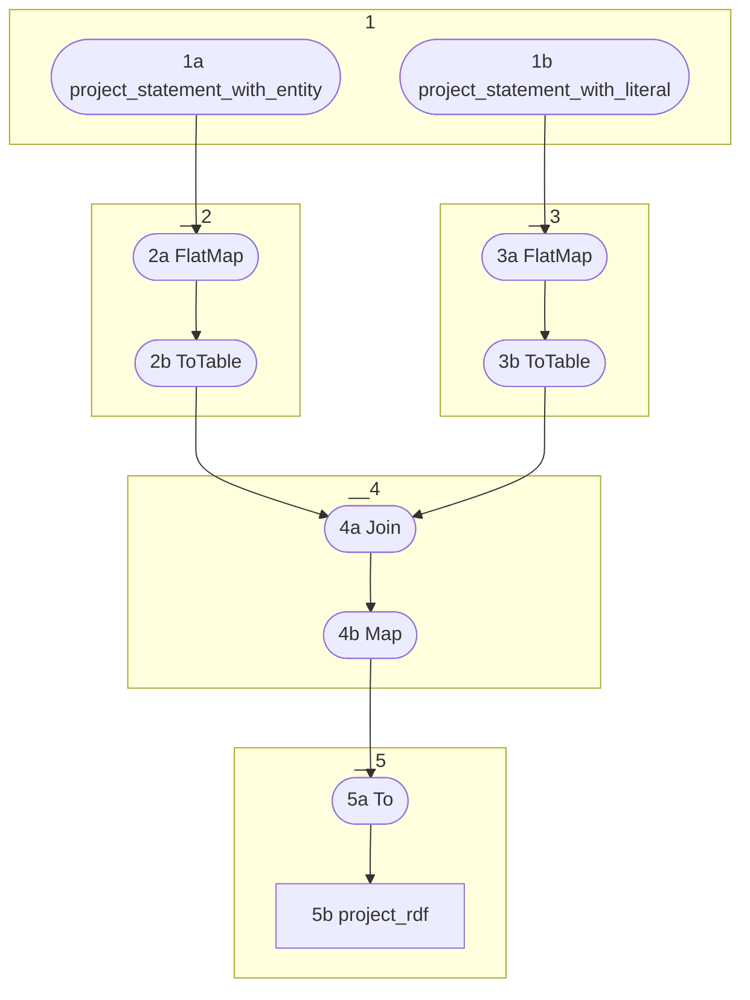

# Topology: ProjectOwlSameAs

This topology produces custom owl:sameAs triples as a short-cut for the path

```
crm:E1 CRM Entity 
    → P28 same as URI [owl:sameAs] (same as) 
        → crm-sup:C30 Uniform Resource Identifier (URI)
            → P21 has value (is value of) 
                → crm:E62 String
```

This requires one join of statements. For performance reasons, the statements are
filtered before the join.



### 1) Register streams
1a) Create a KStream from `project_statement_with_entity`

1b) Create a KStream from `project_statement_with_literal`

### 2) KTable of left statement

2a) FlatMap the stream to List<KeyValue<`ProjectEntityKey`, `Boolean`>>
`TextWithDeleteValue`:
- text `String`
- deleted `Boolean`

Only add an item to the list, if property_id==1943 (same as URI: https://ontome.net/ontology/p1943)

Use the statement.object_id as Key, since we use it to join.

Use __deleted in the a `TextWithDeleteValue`.deleted, since we need to handle deletes.

Use statement.subject_id as `TextWithDeleteValue`.text, since we need this as subject of the final owl:sameAs

2b) ToTable: Convert the stream to a table

### 3) KTable of right statement
3a) FlatMap the stream by List<KeyValue<`ProjectEntityKey`, `TextWithDeleteValue`>>


Only add an item to the list, if
- property_id==1843 (has value: https://ontome.net/ontology/p1843)
- statement.object.appellation.string is a valid URI. Test it with regex: `^[a-z](?:[-a-z0-9\+\.])*:(?:\/\/(?:(?:%[0-9a-f][0-9a-f]|[-a-z0-9\._~!\$&''\(\)\*\+,;=:@])|[\/\?])*)?`

Use statement.subject_id as Key, since we use it to join.

Use __deleted in the a `TextWithDeleteValue`.deleted, since we need to handle deletes.

Use statement.object.appellation.string as `TextWithDeleteValue`.text, since we need this as literal of final owl:sameAs

3b) ToTable: Convert the stream to a table

### 4) Join and produce turtle

4a) Join the KTables (KTable-KTable Equi-Join), creating a `ProjectRdfRecord`
`ProjectRdfRecord`:
- key `ProjectRdfKey`
- value `ProjectRdfValue`

the operation is `insert` if both TextWithDeleteValue are not deleted.

the turtle is:
```
<http://geovistory.org/resource/{left.text}> <http://www.w3.org/2002/07/owl#sameAs> <{right.text}> .
```

4b) Map the `ProjectRdfRecord` to `ProjectRdfKey` and `ProjectRdfValue`.

### 5) sink

5a) To: sink it to `project_rdf`

