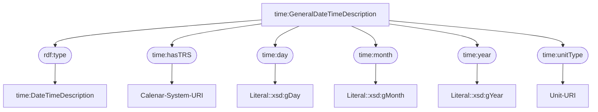

# Topology: ProjectStatementToLiteral


| Step |                                                                                                                  |
|------|------------------------------------------------------------------------------------------------------------------|
| 1    | input topics                                                                                                     |
| 2    | Map each input ProjectStatementKey-ProjectStatementValue-record to two ProjectRdfKey-ProjectRdfValue-records |
|      | one with subject, predicate, object and the inversed one with object, predicate+i, subject                       |
| 3    | To output topic project_rdf                                                                                      |

## Input Topics

_{prefix_out} = TS_OUTPUT_TOPIC_NAME_PREFIX_

| name                                        | label in diagram               | Type    |
|---------------------------------------------|--------------------------------|---------|
| {prefix_out}_project_statement_with_literal | project_statement_with_literal | KStream |

## Output topic

| name                        | label in diagram |
|-----------------------------|------------------|
| {output_prefix}_project_rdf | project_rdf      |

## Output model

### Key: ProjectRdfKey

| field      | type   |
|------------|--------|
| project_id | int    |
| turtle     | string |

### Value: ProjectRdfValue

| field     | type                    |
|-----------|-------------------------|
| operation | enum["insert","delete"] |

## RDF serialization

On the path `statement.object` of a ProjectStatementValue you find a NodeValue:

```json5
// ProjectStatementValue:
{
  // ...
  statement: {
    // java class StatementEnrichedValue
    // ...
    object: {
      // java class NodeValue 
      entity: null,
      // null or java class Entity 
      language: null,
      // null or java class Language 
      appellation: null,
      // null or java class Appellation
      lang_string: null,
      // null or java class LangString
      place: null,
      // null or java class Place
      time_primitive: null,
      // null or java class TimePrimitive
      dimension: null,
      // null or java class Dimension
      cell: null,
      // null or java class Cell
      digital: null
      // null or java class Digital
    }
  }
}
```

NodeValue has 9 keys; 8 are always null.

Depending on the not-null key the produced RDF (turtle) is different.

Statements with `entity` objects are converted to triples with URIs and are not covered by this spec (see
ProjectStatementToUri).

The other (8) object types are discussed below:

### Language

#### In

```json5
// ProjectStatementValue:
{
  'project_id': 567,
  'statement_id': 345,
}
```

```json5
// ProjectStatementValue:
{
  'project_id': 567,
  'subject_id': 'i1761647',
  'property_id': 1112,
  'object_id': 'i2255949',
  'statement': {
    'object': {
      'language': {
        // ...
        'notes': 'Italian',
        'pk_language': 'it'
      }
    }
  },
  '__deleted': 'false',
}
```

#### Out

```json5
// ProjectRdfKey
{
  'project_id': 567,
  'turtle': '<http://geovistory.org/resource/i1761647> <https://ontome.net/ontology/p1112> "Italian"^^<http://www.w3.org/2001/XMLSchema#string> .'
}
```

```json5
// ProjectRdfValue
{
  'operation': 'insert'
}
```

Remark: `language.notes` can be null. In this case pk_language has to be taken.

### Appellation

Remark: The term 'Appellation' is historically grown. Think of it as 'String'.

#### In

```json5
// ProjectStatementValue:
{
  'project_id': 567,
  'statement_id': 345,
}
```

```json5
// ProjectStatementValue:
{
  'project_id': 567,
  'subject_id': 'i1761647',
  'property_id': 1113,
  'object_id': 'i2255949',
  'statement': {
    'object': {
      'appellation': {
        // ...
        'string': 'Foo',
      }
    }
  },
  '__deleted': 'false',
}
```

#### Out

```json5
// ProjectRdfKey
{
  'project_id': 567,
  'turtle': '<http://geovistory.org/resource/i1761647> <https://ontome.net/ontology/p1113> "Foo"^^<http://www.w3.org/2001/XMLSchema#string> .'
}
```

```json5
// ProjectRdfValue
{
  'operation': 'insert'
}
```

### LangString

#### In

```json5
// ProjectStatementValue:
{
  'project_id': 567,
  'statement_id': 345,
}
```

```json5
// ProjectStatementValue:
{
  'project_id': 567,
  'subject_id': 'i1761647',
  'property_id': 1113,
  'object_id': 'i2255949',
  'statement': {
    'object': {
      'lang_string': {
        // ...
        'string': 'Bar',
        'fk_language': 19703,
      }
    }
  },
  '__deleted': 'false',
}
```

`fk_language` refers to an internal identifier of the Geovistory Toolbox. These identifiers have been historically
grown.

`fk_language` can be converted to two character language codes using a HashMap derived from `languageMap` in
`org.geovistory.toolbox.streams.lib.Utils`.

In case the HashMap does not return a language code, use `fk_language`.
This case is expected to be extremely rare. Future improvement would involve a join of lang_string with language
in `org.geovistory.toolbox.streams.statement.enriched.processors.StatementEnriched` in order to retrieve a language
code.

#### Out

```json5
// ProjectRdfKey
{
  'project_id': 567,
  'turtle': '<http://geovistory.org/resource/i1761647> <https://ontome.net/ontology/p1113> "Bar"@it .'
}
```

```json5
// ProjectRdfValue
{
  'operation': 'insert'
}
```

### Place

#### In

```json5
// ProjectStatementValue:
{
  'project_id': 567,
  'statement_id': 345,
}
```

```json5
// ProjectStatementValue:
{
  'project_id': 567,
  'subject_id': 'i1761647',
  'property_id': 1113,
  'object_id': 'i2255949',
  'statement': {
    'object': {
      'place': {
        // ...
        'geo_point': {
          "io.debezium.data.geometry.Geography": {
            "wkb": "AQEAACDmEAAA9DRgkPTJAkB9zAcEOm1IQA==",
            "srid": {
              "int": 4326
            }
          }
        },
      }
    }
  },
  '__deleted': 'false',
}
```

Remarks on `geo_point`

- The `geo_point` is serialized as `io.debezium.data.geometry.Geography`.
- `geo_point.wkb` is a base64 encoded Extended-well-known-binary produced by PostGIS. This needs to be converted to
  well-known-text (WKT); It might be sufficient to decode with `java.util.Base64.getDecoder().decode();`. See examples
  in `org.geovistory.toolbox.streams.lib.GeoUtilsTest`. The resulting WKT should be identical as the output of PostGIS
  ST_AsText().
- `geo_point.srid` is always 4326

For writing tests, this might be helpful:

- `org.geovistory.toolbox.streams.statement.enriched.processors.StatementEnrichedTest`

#### Out

```json5
// ProjectRdfKey
{
  'project_id': 567,
  'turtle': '<http://geovistory.org/resource/i1761647> <https://ontome.net/ontology/p1113> "<http://www.opengis.net/def/crs/EPSG/0/4326>POINT(2.348611 48.853333)"^^<http://www.opengis.net/ont/geosparql#wktLiteral> .'
}
```

```json5
// ProjectRdfValue
{
  'operation': 'insert'
}
```


### TimePrimitive


#### In

```json5
// ProjectStatementValue:
{
  'project_id': 567,
  'statement_id': 345,
}
```

```json5
// ProjectStatementValue:
{
  'project_id': 567,
  'subject_id': 'i1761647',
  'property_id': 71,
  'object_id': 'i2255949',
  'statement': {
    'object': {
      // ...
      'time_primitive': {
        "pk_entity": 769073,
        "duration": {
          "string": "1 year"
        },
        "fk_class": {
          "int": 335
        },
        "julian_day": {
          "int": 2290483
        },
        "calendar": "julian"
      }
    }
  },
  '__deleted': 'false',
}

```

Before we look at the output data, let's understand the input and output model:

#### Input model

Geovistory Toolbox treats Temporal Entities a bit like a subclass of Time-Spans:
A Temporal Entity in the Toolbox can have six properties leading to Time-Primitives:


#### Output model

CIDOC-CRM connects temporal entities with time primitive through an intermediate Time-Span:


For the serialization of [crm:E61 Time Primitive](https://ontome.net/class/335/namespace/1) we use owl time ontology and express it as an instance of [time:GeneralDateTimeDescription](https://www.w3.org/TR/owl-time/#time:GeneralDateTimeDescription):



Everything together:


The serialization of the upper part (`crm:P4 has time-span`) is covered by another issue,
because it depends on the entity being subclass of temporal entity rather than the statement given by the input topic.
The serialization of the lower part is covered by this issue,
since it depends on the statements given by the input topic.

#### Triples produced by other processor
The URI of the intermediate Time-Span is the URI of the Temporal Entity instance suffixed with "ts".
These triples are generated by another processor:

```turtle
# subject uri -> has time span -> time-span uri, and inversed
<http://geovistory.org/resource/i1761647> <https://ontome.net/ontology/p4> <http://geovistory.org/resource/i1761647ts> .
<http://geovistory.org/resource/i1761647ts> <https://ontome.net/ontology/p4i> <http://geovistory.org/resource/i1761647> .

# time-span uri -> a -> Time-Span
<http://geovistory.org/resource/i1761647ts> a  <https://ontome.net/ontology/c50> .

# time-span uri -> has label -> string literal
<http://geovistory.org/resource/i1761647ts> <http://www.w3.org/2000/01/rdf-schema#label> "Time span of {entity-label}".
```

#### Out

Instead of using the subject uri we use the time-span uri produced by the other processor.
According to the input example (in), the processor has to generate 9 messages:

```json5
// ProjectRdfKey 1..9
{
  'project_id': 567,
  'turtle': 'see below'
}
```
```json5
// ProjectRdfValue 1..9
{
  'operation': 'insert'
}
```


**Turtle 1**

```
# time span uri -> at some time within -> date time description uri

<http://geovistory.org/resource/i1761647ts> <https://ontome.net/ontology/p71> <http://geovistory.org/resource/i2255949'
```

**Turtle 2**

```
# inverse of: time span uri -> at some time within -> date time description uri

<http://geovistory.org/resource/i2255949> <https://ontome.net/ontology/p71i> <http://geovistory.org/resource/i1761647ts>
```

**Turtle 3**

```
# date time description uri -> a -> time:DateTimeDescription

<http://geovistory.org/resource/i2255949> a <http://www.w3.org/2006/time#DateTimeDescription>
```

**Turtle 4**

```
# date time description uri -> time:hasTRS -> <{trs_uri}>

# case calendar='julian' (as in example)
<http://geovistory.org/resource/i2255949>  <http://www.w3.org/2006/time#hasTRS> <https://d-nb.info/gnd/4318310-4>

# case calendar='gregorian'
<http://geovistory.org/resource/i2255949>  <http://www.w3.org/2006/time#hasTRS> <http://www.opengis.net/def/uom/ISO-8601/0/Gregorian> 
```


**Turtle 5**
```
# date time description uri -> time:day -> literal^^time:generalDay
<http://geovistory.org/resource/i2255949>  <http://www.w3.org/2006/time#day> "---01"^^<http://www.w3.org/2006/time#generalDay>

# Literal spec: https://www.w3.org/TR/owl-time/#time:generalDay
# (three dashes followed by 0-padded number with two positions)

```

**Turtle 6**
```
# date time description uri -> time:month -> literal^^time:generalMonth

<http://geovistory.org/resource/i2255949>  <http://www.w3.org/2006/time#month> "--01"^^<http://www.w3.org/2006/time#generalMonth>

# Literal spec: https://www.w3.org/TR/owl-time/#time:generalMonth
# (two dashes followed by 0-padded number with two positions)
```

**Turtle 7**
```
# date time description uri -> time:year -> literal^^time:generalYear

<http://geovistory.org/resource/i2255949>  <http://www.w3.org/2006/time#year> "-1559"^^<http://www.w3.org/2006/time#generalYear>

# Literal spec: https://www.w3.org/TR/owl-time/#time:generalYear
# (one dash followed by 0-padded number with four positions)
```

**Turtle 8**
```
# date time description uri -> time:unitType -> <time:{unit_type}>

# case duration='1 year' (as in example)
<http://geovistory.org/resource/i2255949>  <http://www.w3.org/2006/time#hasTRS> <http://www.w3.org/2006/time#unitYear>

# case duration='1 month'
<http://geovistory.org/resource/i2255949>  <http://www.w3.org/2006/time#hasTRS> <http://www.w3.org/2006/time#unitMonth>

# case duration='1 day'
<http://geovistory.org/resource/i2255949>  <http://www.w3.org/2006/time#hasTRS> <http://www.w3.org/2006/time#unitDay>
```

**Turtle 9**
```
# date time description uri -> rdfs:label -> literal^^xsd:string

# case duration='1 year' (as in example)
<http://geovistory.org/resource/i2255949>  <http://www.w3.org/2006/time#year> "1559"^^<http://www.w3.org/2001/XMLSchema#string>

# case duration='1 month'
<http://geovistory.org/resource/i2255949>  <http://www.w3.org/2006/time#year> "1559-01"^^<http://www.w3.org/2001/XMLSchema#string>

# case duration='1 day'
<http://geovistory.org/resource/i2255949>  <http://www.w3.org/2006/time#year> "1559-01-01"^^<http://www.w3.org/2001/XMLSchema#string>

```

Remark: The same julian day may lead to different year, month and day in julian/gregorian calendar.
A helper function is implemented in `org.geovistory.toolbox.streams.lib.TimeUtils`.


### Dimension

#### In

```json5
// ProjectStatementValue:
{
  'project_id': 567,
  'statement_id': 345,
}
```

```json5
// ProjectStatementValue:
{
  'project_id': 567,
  'subject_id': 'i1761647',
  'property_id': 40,
  'object_id': 'i2255949',
  'statement': {
    'object': {
      "dimension": {
        //...
        "fk_measurement_unit": 880899,
        "numeric_value": 10
      }
    }
  },
  '__deleted': 'false',
}
```

#### Out

```json5
// ProjectRdfKey
{
  'project_id': 567,
  'turtle': 'see below'
}
```

```json5
// ProjectRdfValue
{
  'operation': 'insert'
}
```

**Turtle 1**

``` 
# has dimension
<http://geovistory.org/resource/i1761647> <https://ontome.net/ontology/p40> <http://geovistory.org/resource/i2255949>
```

**Turtle 2**

``` 
# inverse of: has dimension
<http://geovistory.org/resource/i2255949> <https://ontome.net/ontology/p40i> <http://geovistory.org/resource/i1761647>
```


**Turtle 3**

``` 
# crm:P90 has value
<http://geovistory.org/resource/i2255949> <https://ontome.net/ontology/p78> "10"^^<http://www.w3.org/2001/XMLSchema#decimal>
```

**Turtle 4**

``` 
# crm:P91 has unit (is unit of)
<http://geovistory.org/resource/i2255949> <https://ontome.net/ontology/p79> <http://geovistory.org/resource/i880899>
```

**Turtle 5**

``` 
# inverse of: crm:P91 has unit (is unit of)
<http://geovistory.org/resource/i880899> <https://ontome.net/ontology/p79i> <http://geovistory.org/resource/i2255949>
```

### Cell

TODO

### Digital

TODO

