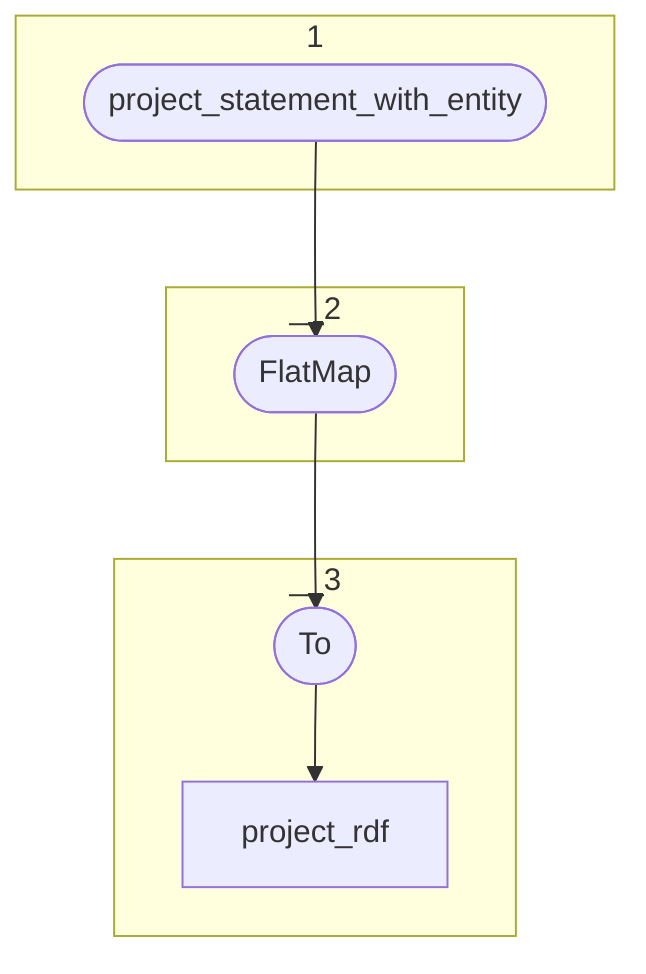

# Topology: ProjectStatementToUri



| Step |                                                                                                                  |
|------|------------------------------------------------------------------------------------------------------------------|
| 1    | input topics                                                                                                     |
| 2    | FlatMap each input ProjectStatementKey-ProjectStatementValue-record to two ProjectRdfKey-ProjectRdfValue-records |
|      | one with subject, predicate, object and the inversed one with object, predicate+i, subject                       |
| 3    | To output topic project_rdf                                                                                      |


## Input Topics

_{prefix_out} = TS_OUTPUT_TOPIC_NAME_PREFIX_

| name                                       | label in diagram              | Type    |
|--------------------------------------------|-------------------------------|---------|
| {prefix_out}_project_statement_with_entity | project_statement_with_entity | KStream |

## Output topic

| name                        | label in diagram |
|-----------------------------|-----------------|
| {output_prefix}_project_rdf | project_rdf     |

## Output model

### Key: ProjectRdfKey

| field      | type   |
|------------|--------|
| project_id | int    |
| turtle     | string |

### Value: ProjectRdfValue

| field        | type                    |
|--------------|-------------------------|
| operation    | enum["insert","delete"] |


## Example

### In

```json5
// ProjectStatementValue:
{
  "project_id": 567,
  "statement_id": 345,
}
```
```json5
// ProjectStatementValue:
{
  "project_id": 567,
  "subject_id": "i1761647",
  "property_id": 1762,
  "object_id": "i2255949",
  "__deleted": "true",
  // ...
}
```

### Out

Message 1

```json5
// ProjectRdfKey
{
  "project_id": 567,
  "turtle": "<http://geovistory.org/resource/i1761647> <https://ontome.net/ontology/p1762> <http://geovistory.org/resource/i2255949> "
}
```
```json5
// ProjectRdfValue
{
  "operation": "delete"
}
```


Message 2 (inverse triple)

```json5
// ProjectRdfKey
{
  "project_id": 567,
  "turtle": "<http://geovistory.org/resource/i2255949> <https://ontome.net/ontology/p1762i> <http://geovistory.org/resource/i1761647> "
}

// Remark the 'i' in the predicate !
```
```json5
// ProjectRdfValue
{
  "operation": "delete"
}
```