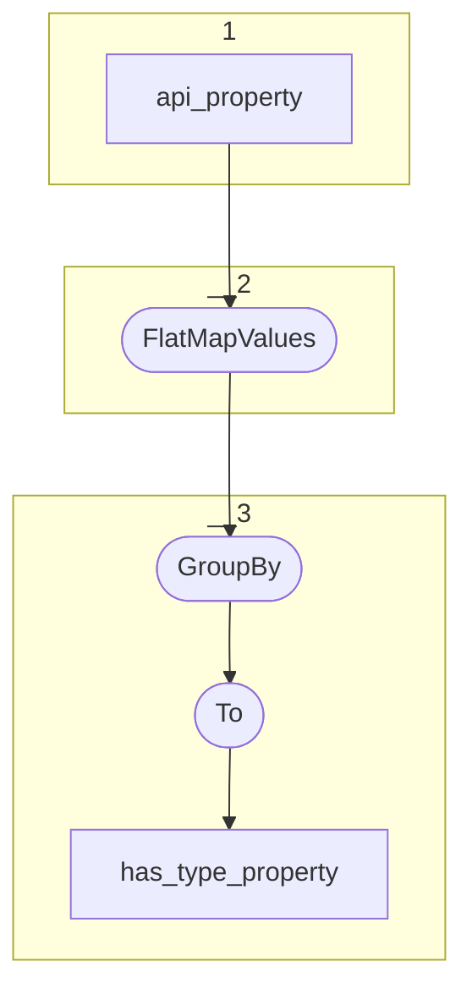

# Topology: Ontome Property Label

This topology generates property ids for has type sub-properties, grouped by domain class.

| Step |                                                                                                        |
|------|--------------------------------------------------------------------------------------------------------|
| 1    | input topics                                                                                           |
| 2    | FlatMapValues: parent or ancestor properties have to contain has type (https://ontome.net/ontology/p2) |
| 3    | GroupBy domain class                                                                                   |

## Input Topics

_{prefix_in} = TS_INPUT_TOPIC_NAME_PREFIX_

_{prefix_out} = TS_OUTPUT_TOPIC_NAME_PREFIX_

| name                                         | label in diagram | Type   |
|----------------------------------------------|------------------|--------|
| {input_prefix}_data_for_history_api_property | api_property     | KTable |

## Output topic

| name                              | label in diagram  |
|-----------------------------------|-------------------|
| {output_prefix}_has_type_property | has_type_property |

## Output model

### Key: HasTypePropertyKey

| field    | type |
|----------|------|
| class_id | int  |

### Value: HasTypePropertyValue

| field      | type          |
|------------|---------------|
| class_id   | int  |
| property_id | int  |
| __deleted  | boolean, null |