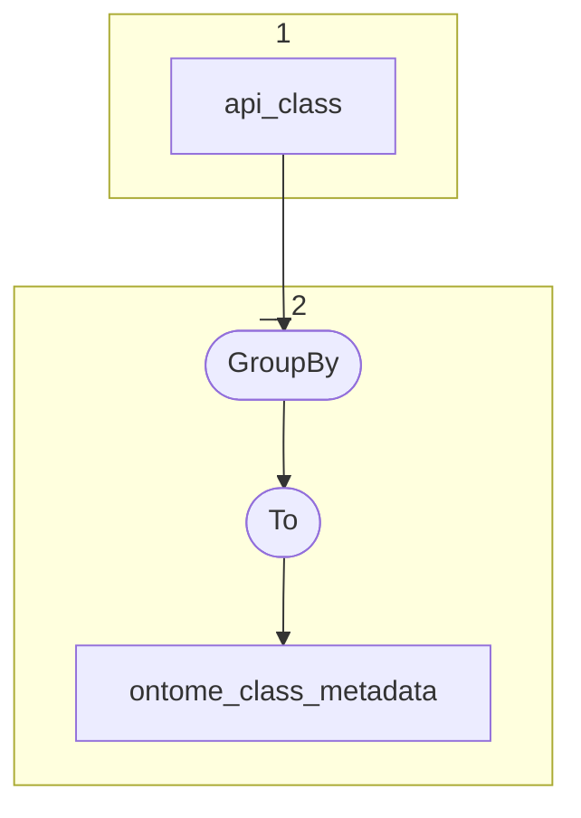

# Topology: Ontome Class Metadata

This topology generates ontome class metadata, keyed by classId.

| Step |                                                                         |
|------|-------------------------------------------------------------------------|
| 1    | input topics                                                            |
| 2    | Group each record to Key: OntomeClassKey, Val: OntomeClassMetadataValue |
|      | To topic `ontome_class_metadata`                                        |

## Input Topics

_{prefix_in} = TS_INPUT_TOPIC_NAME_PREFIX_

| name                                      | label in diagram | Type   |
|-------------------------------------------|------------------|--------|
| {input_prefix}_data_for_history_api_class | api_class        | KTable |

## Output topic

| name                                  | label in diagram      |
|---------------------------------------|-----------------------|
| {output_prefix}_ontome_class_metadata | ontome_class_metadata |

## Output model

### Key

| name     | type |
|----------|------|
| class_id | int  |

### Value

| name             | type        |
|------------------|-------------|
| parent_classes   | int[], null |
| ancestor_classes | int[], null |
