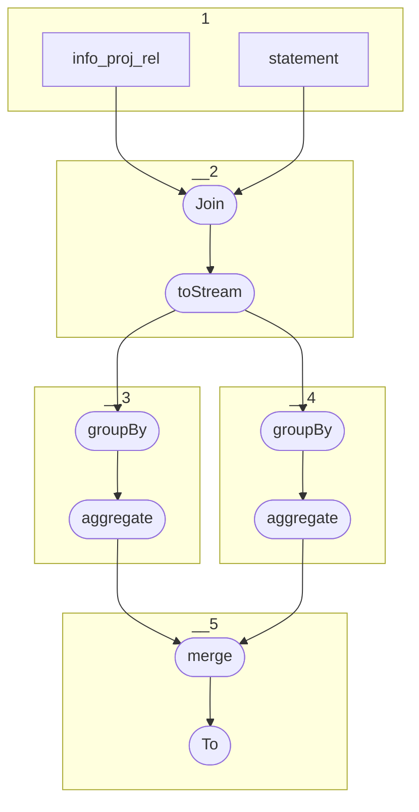

# Topology: Project Field Change

| Step |                                                                    |
|------|--------------------------------------------------------------------|
| 1    | input topics                                                       |
| 2    | Join on foreign key info_proj_rel.fk_entity = project_statement.id |
| 3    | Group by FieldChangeKey using fk_object                            |
| 3    | Group by FieldChangeKey using fk_subject                           |
| 5    | merge                                                              |
|      | To topic `project_field_change`                                    |

## Input Topics

_{prefix_in} = TS_INPUT_TOPIC_NAME_PREFIX_

_{prefix_out} = TS_OUTPUT_TOPIC_NAME_PREFIX_

| name                                  | label in diagram   | Type   |
|---------------------------------------|--------------------|--------|
| {input_prefix}_projects_info_proj_rel | info_proj_rel      | KTable |
| {prefix_out}_statement_enriched       | statement_enriched | KTable |

## Output topic

| name                                | label in diagram       |
|-------------------------------------|------------------------|
| {prefix_out}_project_top_statements | project_top_statements |

## Output model

### Key (FieldChangeKey)

| field                   | type    |
|-------------------------|---------|
| fk_project              | int     |
| fk_source_info          | int     |
| fk_source_tables_cell   | long    |
| fk_property             | int     |
| fk_property_of_property | int     |
| is_outgoing             | boolean |

### Value (FieldChangeValue)

| field                  | type                           |
|------------------------|--------------------------------|
| tmsp_last_modification | long (logical type: timestamp) |

