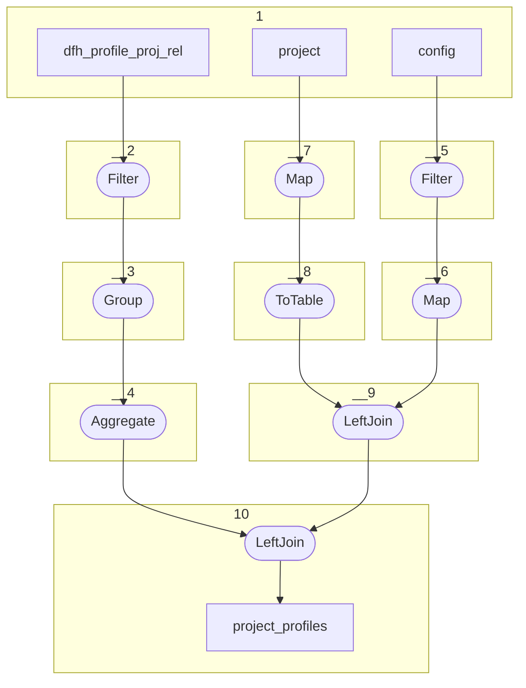

# Topology: ProjectProfiles

| Step |                                                                       |
|------|-----------------------------------------------------------------------|
| 1    | input topics                                                          |
| 2    | Filter: only enabled profiles project relations                       |
| 3    | Group: by project                                                     |
| 4    | Aggregate: Key: project, Val: array of profiles                       |
| 5    | Filter: only rows with key = SYS_CONFIG                               |
| 6    | Map: Key=constant Val=array of required profiles from sys config json |
| 8    | ToTable: to table                                                     |
| 7    | Map: Key=project id, Value=project id (we only need project ids)      |
| 9    | LeftJoin: projects (left) with config (right) with required profiles  |
| 10   | LeftJoin: 10 (left) with 4 (right) to project_profiles                |

## Input Topics

_{ns}= dev / stag / prod_

| name                               | label in diagram     | Type   |
|------------------------------------|----------------------|--------|
| {ns}.projects.project              | project              | KTable |
| {ns}.projects.dfh_profile_proj_rel | dfh_profile_proj_rel | KTable |
| {ns}.system.config                 | config               | KTable |

## Output topic

| name                     | label in diagram |
|--------------------------|------------------|
| {ns}.ts.project_profiles | project_profiles |

## Output model

| name  | description                                                           |
|-------|-----------------------------------------------------------------------|
| Key   | id of geovistory project                                              |
| Value | Array of OntoME profile ids enabled by project or required by system. |
