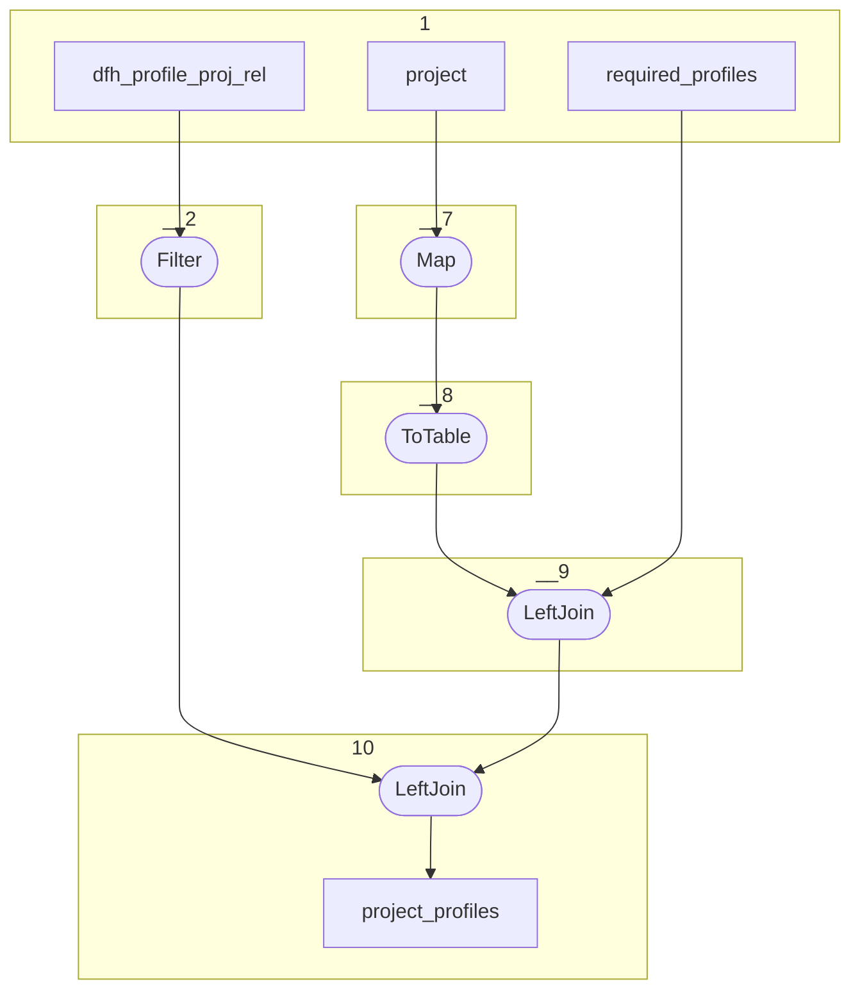

# Topology: ProjectProfiles

```mermaid
flowchart TD
    1a-->7a
    7a-->8a
    8a-->9a
    1c-->2a
    2a-->10a
    1b-->9a
    9a-->10a
    10a-->10b
    subgraph 1
        direction RL
        1a[project]
        1b[required_profiles]
        1c[dfh_profile_proj_rel]
    end
    subgraph __2
       2a([Filter])
    end
    subgraph __9
       9a([LeftJoin])
    end
    subgraph 10
       10a([LeftJoin])
       10b[project_profiles]
    end
    subgraph __7
       7a([Map])
    end
    subgraph __8
       8a([ToTable])
    end

```

| Step |                                                                  |
|------|------------------------------------------------------------------|
| 1    | input topics                                                     |
| 2    | Filter: only enabled profiles project relations                  |
| 7    | Map: Key=project id, Value=project id (we only need project ids) |
| 8    | ToTable: to table                                                |
| 9    | LeftJoin: projects (left) with required_profiles (right)         |
| 10   | LeftJoin: 9 (left) with 2 (right) to project_profiles            |

## Input Topics

_{ns}= dev / stag / prod_

| name                               | label in diagram     | Type   |
|------------------------------------|----------------------|--------|
| {ns}.projects.project              | project              | KTable |
| {ns}.projects.dfh_profile_proj_rel | dfh_profile_proj_rel | KTable |
| {ns}.ts.required_profiles          | required_profiles    | KTable |

## Output topic

| name                     | label in diagram |
|--------------------------|------------------|
| {ns}.ts.project_profiles | project_profiles |

## Output model

| name  | description            |
|-------|------------------------|
| Key   | project and profile id |
| Value | true                   |
