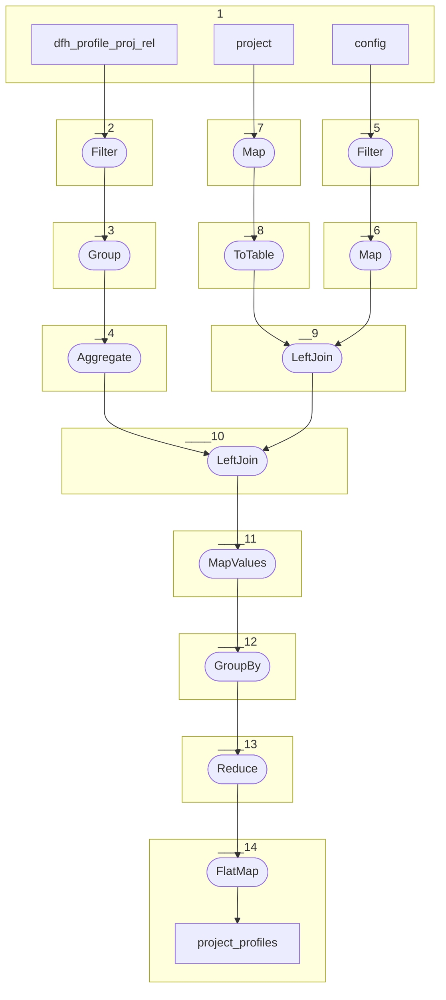

# Topology: ProjectProfiles

| Step |                                                                             |
|------|-----------------------------------------------------------------------------|
| 1    | input topics                                                                |
| 2    | Filter: only enabled profiles project relations                             |
| 3    | Group: by project                                                           |
| 4    | Aggregate: Key: project, Val: array of profiles                             |
| 5    | Filter: only rows with key = SYS_CONFIG                                     |
| 6    | Map: Key=constant Val=array of required profiles from sys config json       |
| 8    | ToTable: to table                                                           |
| 7    | Map: Key=project id, Value=project id (we only need project ids)            |
| 9    | LeftJoin: projects (left) with config (right) with required profiles        |
| 10   | LeftJoin: 10 (left) with 4 (right) to projects_with_aggregated_profiles     |
| 11   | Values: BooleanMap with profileId as key and false as value (= not deleted) |
| 12   | GroupByKey                                                                  |
| 13   | Reduce: mark missing profiles in new value as deleted                       |
| 14   | FlatMap: for each profile per project create one profileProject record      |

## Input Topics

_{ns}= dev / stag / prod_

| name                               | label in diagram     | Type   |
|------------------------------------|----------------------|--------|
| {ns}.projects.project              | project              | KTable |
| {ns}.projects.dfh_profile_proj_rel | dfh_profile_proj_rel | KTable |
| {ns}.system.config                 | config               | KTable |

## Output topic

| name                                      | label in diagram                  |
|-------------------------------------------|-----------------------------------|
| {ns}.ts.projects_with_aggregated_profiles | projects_with_aggregated_profiles |

## Output model

| name  | description                     |
|-------|---------------------------------|
| Key   | projectId, profileId            |
| Value | projectId, profileId, __deleted |
