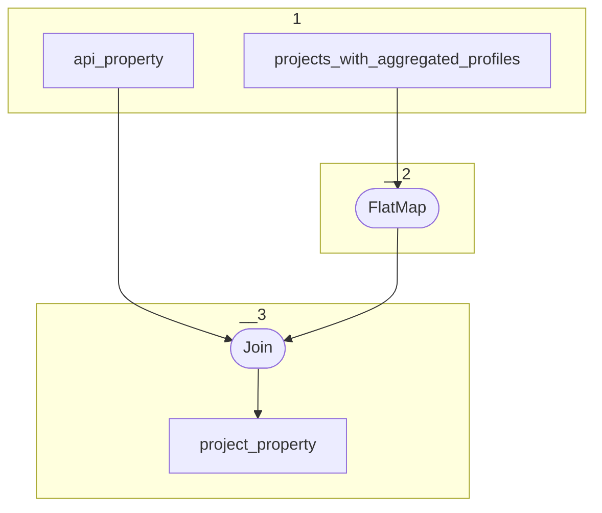

# Topology: ProjectProperty

| Step |                                                                            |
|------|----------------------------------------------------------------------------|
| 1    | input topics                                                               |
| 2    | FlatMap: one project-profiles record to multiple project-profile records   |
| 3    | Join: on project, Key: projectId, domainId, propertyId, rangeId, Val: true |

## Input Topics

_{ns}= dev / stag / prod_

| name                                      | label in diagram                  | Type   |
|-------------------------------------------|-----------------------------------|--------|
| {ns}.data_for_history.api_property        | api_property                      | KTable |
| {ns}.ts.projects_with_aggregated_profiles | projects_with_aggregated_profiles | KTable |

## Output topic

| name                     | label in diagram |
|--------------------------|------------------|
| {ns}.ts.project_property | project_property |

## Output model

| name  | description                              |
|-------|------------------------------------------|
| Key   | projectId, domainId, propertyId, rangeId |
| Value | projectId, domainId, propertyId, rangeId |
