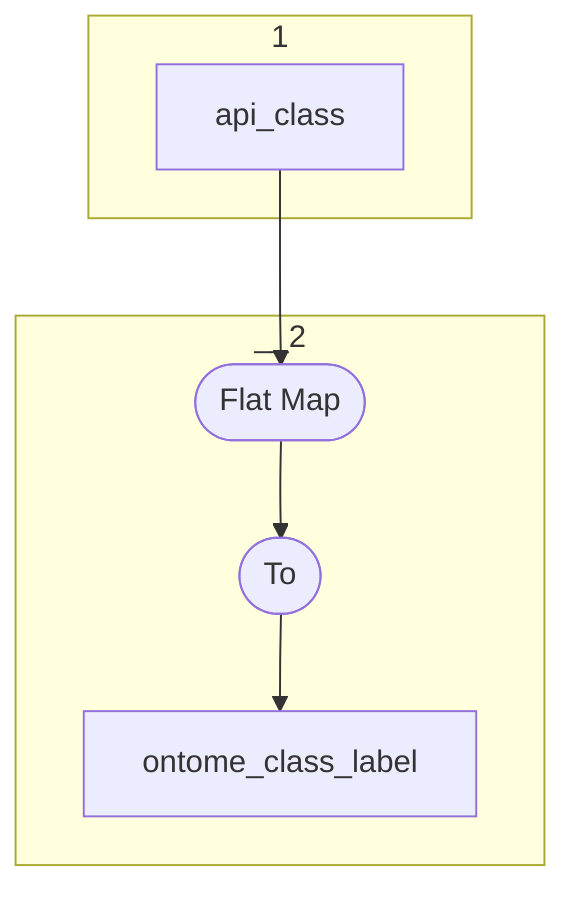

# Topology: Ontome Class Label

This topology generates ontome class labels, keyed by classId and languageId.

| Step |                                                                                                                                                                        |
|------|------------------------------------------------------------------------------------------------------------------------------------------------------------------------|
| 1    | input topics                                                                                                                                                           |
| 2    | FlatMap each record to Key: ClassId=`dfh_pk_class`, LanguageId=`id of dfh_class_label_language`; Value: `dfh_class_label`, LanguageId=`id of dfh_class_label_language` |
|      | To topic `ontome_class_label`                                                                                                                                          |

## Input Topics

_{prefix_in} = TS_INPUT_TOPIC_NAME_PREFIX_

_{prefix_out} = TS_OUTPUT_TOPIC_NAME_PREFIX_

| name                                      | label in diagram | Type   |
|-------------------------------------------|------------------|--------|
| {input_prefix}_data_for_history_api_class | api_class        | KTable |

## Output topic

| name                               | label in diagram   |
|------------------------------------|--------------------|
| {output_prefix}_ontome_class_label | ontome_class_label |

## Output model

| name  | description                           |
|-------|---------------------------------------|
| Key   | classId, languageId                   |
| Value | classId, languageId, label, __deleted |
